# 硬件使用指南

---

## 简介

> 聊天聊出来的一句话觉得很有道理，知识有知识的诅咒，老手永远想象不到新手会从什么地方发生错误，所以protocol由新手去写或许能更清晰一些。这部分生存指南没办法写成字典，让所有的硬件问题在里面一搜就能获得答案，但希望尽力写成地图，能达到"知道我们有什么"和"可能用什么解决问题"两点，也就幸甚至哉了。 -- GMC

- 本文件主要用于帮助用户熟悉目前实验室内主要的电子元件、开发板、自制电路板、标准件、加工设备等的位置和使用方法
- 使用工具前请**务必阅读使用说明**及**学习使用方法和注意事项**

---

## 主要零件和工具存放位置

这部分主要介绍实验室中用于机械加工和设备搭建所需的主要工具和耗材的存放位置

### 219-1

**元件存放柜1（塑料抽屉）**

| 顶部        | 亚克力板     | 亚克力快     |             |          |
|:---------:|:--------:|:--------:|:-----------:|:--------:|
| Arduino   | 机箱螺母     | 电容触摸板    | 水嘴固定件       | 灌胃针(水嘴)  |
| ↑         | BNC头♀    | 风扇       | Miniscope配件 | 损坏器件     |
| ↑，ESP32   | BNC头♂    | ↑        | 轴承          | 涂料       |
| -         | 三芯头♀     | 端子、跳线帽   | DAQ配件       | -        |
| 排针        | 三芯头♂     | 万用板（洞洞板） | SMA/IPEX接头  | 玻璃注射器    |
| ↑         | 多芯头      | 红外收发器    | 芯片编程器       | -        |
| 面包板       | ↑        | 多路开关     | 单路开关        | 杜邦线端子    |
| ↑         | 中心冲      | 蜂鸣器      | ↑           | XH/SH端子线 |
| 3V-5V电平转换 | 继电器      | 步进电机驱动   | -           | 散热片      |
| ↑         | ↑        | -        | -           | -        |
| LED灯      | 面包板电源    | 标签       | 端子接头        | -        |
| ↑         | ADNS3080 | ↑        | 说明书         | 机箱连接件    |
| ↑         | LED灯     | -        | ↑           | 磁铁       |
| ↑         | -        | -        | -           | ↑        |
| DC母座      | -        | 电磁阀      | -           | -        |

**元件存放柜2（铁皮抽屉）**

| 顶部      |            |           |
|:-------:|:----------:|:---------:|
| 跳线      | 跳线、漆包线、OK线 | 零散电子器件    |
| ↑       | 电容电阻       | ↑         |
| -       | 砂纸         | DC开关线     |
| 表笔      | HDMI/DP线   | DC线       |
| 5V电源    | USB线       | 塑料扎带      |
| 9V电源    | ↑          | 水管接头、鲁尔头  |
| 12V电源   | ↑          | XH/SH线    |
| 24V电源   | ↑          | Basler相机线 |
| 铝型材配件   | ↑          | 螺丝螺母      |
| 蠕动泵、电磁阀 | USB开关线     | BNC编织线    |

**标准件存放柜及桌面和桌下（金属桌）**

| 多种螺丝螺母及铝型材标准件，冷压端子 |
| ------------------ |

**大型储物柜**

| 顶部     | 上层                   | 下层             |
|:------:|:--------------------:|:--------------:|
| 注射泵、杂物 | 马达、玻璃注射器、各种水管、弹力线、杂物 | 气泵和气管、铁丝、灯管、杂物 |

**桌下抽屉**

| 左        | 右             |
|:--------:|:-------------:|
| 空塑料盒     | 热熔胶、电钻等电动工具   |
| 各种液体胶和树脂 | 各种螺丝刀、扳手、游标卡尺 |
| 杂物       | 光轴及配件         |

**桌面及墙面**

| 各种胶带 | 白光/红外摄像头 | 各种工具头和套筒、钻头、手动工具 | 焊接耗材、热缩管 | 压缩空气、柠檬除胶剂、丁烷气、喷漆、润滑油和凡士林 | 各种电线 | 塑料袋、橡皮筋 |
|:----:|:--------:|:----------------:|:--------:|:-------------------------:|:----:|:-------:|
|      |          |                  |          |                           |      |         |

**里屋**

| 铝型材及部分配件、遮光膜、磨砂膜等 |
|:-----------------:|

### 219-2

**桌下抽屉**

| Miniscope DAQ 板；小亚克力板、块、垫片 |
|:--------------------------:|
|                            |

**桌面**

| LED灯带；各种M1.5、M2螺丝；Miniscope和光遗传Baseplate |
|:----------------------------------------:|

### 219-3

**防潮柜**

| 3D打印耗材（热熔，已开封） | Arduino板、Miniscope板 |     |     |
|:--------------:|:-------------------:|:---:|:---:|

### 219

**桌下抽屉及地面（金属桌）**

| 3D打印机喷嘴、适配支架 | 3D打印耗材（光固化） | 氯化钙干燥剂、盆 | 3D打印耗材（热熔，未开封） |
|:------------:|:-----------:|:--------:|:--------------:|

**桌下抽屉**

| 1      | 2   | 3       | 4           |
|:------:|:---:|:-------:|:-----------:|
| 一次性注射器 | 离心管 | 多孔板、培养皿 | -           |
| -      | -   | -       | -           |
| 一次性输液器 | -   | -       | 铝箔纸、保鲜膜、封口膜 |

---

## 工具使用方法

这部分大致介绍实验室目前有哪些工具可以满足你的加工需求，如不清楚使用方法可以询问或者搜索

### 手动工具

- **螺丝刀和扳手**
  
  螺丝刀：拧螺丝的，有成盒的螺丝刀套件和有可替换头的，常用的有十字、一字、梅花和内六角（小直径），也有电动的
  
  扳手：同上不过力矩更大，有各种L形内六角扳手（套件），外六角扳手（套件和可调），**如果某个螺丝所有尺寸扳手都不能使用，那么他可能是英标螺栓的，请寻找专用的英标扳手**，也有一种可使用电动螺丝工具头的棘轮扳手
  
  丝锥：可以在圆柱孔内攻出螺纹，当然在塑料等软质材料上可以直接用螺丝/自攻螺丝拧出来不用额外攻牙
  
  用来攻丝的孔对直径大小有一定要求 🔗 [螺纹钻孔直径对照表](https://zhuanlan.zhihu.com/p/591750299)，单实际上在软材料上的要求并不算严格，跟螺纹小径差不多即可 🔗 [〔技术参数〕公制螺纹尺寸规格一览表](https://zhuanlan.zhihu.com/p/67286907)

- **钳**
  
  水口钳：修剪塑料件等表面突起的部分，也可以用于剪断细电线，给电线剥皮等，类似于力矩大、更锋利的剪刀，**注意不要用来剪铁丝之类的硬物！**
  
  老虎钳：夹持、拔取、钣弯、拧动某些东西，也可以用来剪断铁丝，万用工具
  
  尖嘴钳：类似老虎钳，力矩小但更加灵活，看顺手程度选择
  
  剥线钳：剪短电线和给电线剥皮，有带刃和多功能自动两种，用法不相同
  
  🔗 [市场上常见的剥线钳款式对比](https://www.bilibili.com/video/BV1Pv4y1J7xD/)
  
  压线钳：用于将电线金属丝固定到套管上的工具，使用方法见*U形冷压端子*
  
  台钳：将工件或者某些工具固定到桌面上，同时有部分铁砧的功能
  
  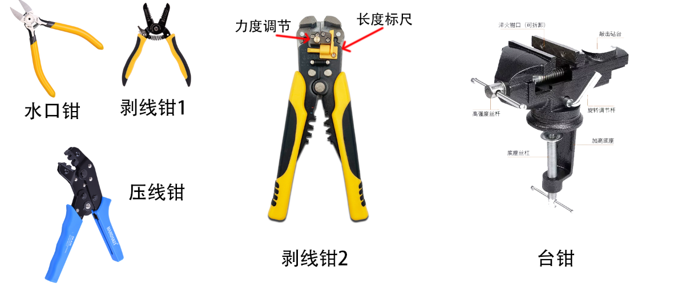

- **锤**
  
  羊角锤：砸平某些东西，从墙上拆装钉子，⚠️ **不要在瓷砖地面上使用**

- **镊**
  
  夹取零件或杂物，有各种头的，其中有高精度镊子（用于焊接精细电极）放在抽屉中的盒子里，⚠️**注意用的时候一定要不要太用力，也不要戳硬物**，还有一种陶瓷头镊子夜放在抽屉中，精度高且可以耐高温且绝缘，⚠️**小心别摔碎**

- **刀和剪刀**：
  
  🔗 [如何使用刀（2/3）？美工刀、铡刀、圆刀、多功能刀、雕刻刀](https://www.bilibili.com/video/BV1xZ4y1X7Nx)

- **锯**：
  
  🔗 [工具 | 如何使用锯子](https://www.bilibili.com/video/BV1rZ4y1A7Sj/)

- **尺**：
  
  🔗 [工具 | 怎么使用量度工具？各种长度要怎么测？](https://www.bilibili.com/video/BV1cK411M7to)
  
  游标卡尺：有外径、内径和深度三种模式，直接读示数就可以，如果合拢不是0的话请点击清零，**精密工具，小心使用，轻拿轻放！**
  
  钢尺和卷尺
  
  直角尺

- **锉刀、砂纸、海棉纱纸和抛光条**：打磨工具

### 电动工具

⚠️ **大部分电动工具都相当危险！请仔细阅读使用说明，并且询问其他人！**

⚠️ **工具通电前请务必检查，电源是否处于关闭状态，工具头是否安装到位！**

⚠️ **使用高速旋转的时候不要戴手套和披散头发！**

⚠️ **请关闭电源再拆卸工具头！**

🔗 参考：[小型机工具使用手册](https://max.book118.com/html/2024/0821/7005053066006144.shtm)

- **电动螺丝刀**：可选工具头很多，也可用于给孔攻丝

- **直磨机（电磨）**：雕刻、打磨、钻孔、切割等，一般用于加工塑料和铝制件等软质材料，💡**转速开到1/5即可，太高容易抖动和失控，进刀量一定要小！**
  
  现在有大型（有线，动力强，执笔或掌握式握持）和小型（无线，执笔式握持）两种，大型电磨可以夹在台钳上使用，手持使用的时候一定要握紧
  
  🔗 [电磨机的使用](https://zhuanlan.zhihu.com/p/33596438)
  
  根据所用需求可以选择安装：
  
  - 麻花钻：多种不同直径，用于软质材料简单钻孔和扩孔，对于塑料或者铝材使用高速低进给，不要用于不锈钢等更硬的材料的钻孔（不锈钢钻孔需使用手电钻略，低速抵紧）
  - 圆锯片/木工锯片：切割金属/塑料等软材料，最好夹持在台钳上使用
  - 磨盘和砂轮：打磨
  - 其他

- **台钻**：
  
  打孔（麻花钻）——💡各种塑料1000rpm即可，钢/铝参考机身侧面钻孔深度-转速对照表（不算太深的话2500即可），钻孔前请用中心冲或其他方式定位
  
  🔗 [手把手教你：如何用台钻](https://www.bilibili.com/video/BV1Bx4y127NL)
  
  铣削（铣刀）——🔗 [在线铣削操作计算器](https://www.bchrt.com/tools/milling-calculator/)
  
  机身后侧有高度刻度手轮，确定高度后移动固定台即可完成简单铣削，（麻花钻只能用于对塑料件进行缓慢、小量的横向加工（例如扩孔）

- **手提钻/冲击钻**：墙面、金属板、模板等钻孔（大孔）和扩孔
  
  🔗 [工具 | 如何使用冲击钻？从妈见打进化为妈见夸](https://www.bilibili.com/video/BV1ai4y1b7MB)

- **角磨机**：切割、打磨等，一般用于切割大块塑料板、金属板、铝型材等
  
  ⚠️ **角磨机是最危险的电动工具之一，如果你不想少零件，请务必仔细阅读使用说明**
  
  ⚠️ **禁止在非固定情况下安装带齿锯片加工木材和塑料**
  
  ⚠️ **禁止不安装把手操作**
  
  🔗 [工具 | 如何使用角磨机？切割、打磨、抛光](https://www.bilibili.com/video/BV1nK411P7yn)
  
  角磨机一般安装到多功能支架上当台锯使用，安装方法见台架说明书

### 胶带与胶水

- **胶带**：各种透明胶带、警戒线、海绵胶（白色的粘性极强，但质地较软易撕裂；黑色的比较坚韧，可以无痕移除）、纸胶带、PE静电胶带（除尘）、绝缘胶带（电工胶带）、ESD胶带（耐高温防静电）、铝箔胶带（保温、防水、静电屏蔽）、导热胶带、双面魔术贴带、生料带（防水）等，根据用途选择
  
  🔗 [工具 | 如何使用胶带(1/2)？透明胶、封箱胶、静电膜、布基胶带、双面胶、水溶双面胶、点胶、海绵胶、纸胶带、美纹纸、遮盖胶带](https://www.bilibili.com/video/BV1wb411o7Ce)
  
  🔗 [工具 | 如何使用胶带(2/2)？生胶带、绝缘胶带、金属胶带、耐高温胶带，还有久违的用各种胶和胶带，做个东西](https://www.bilibili.com/video/BV1iT41167oi)
  
  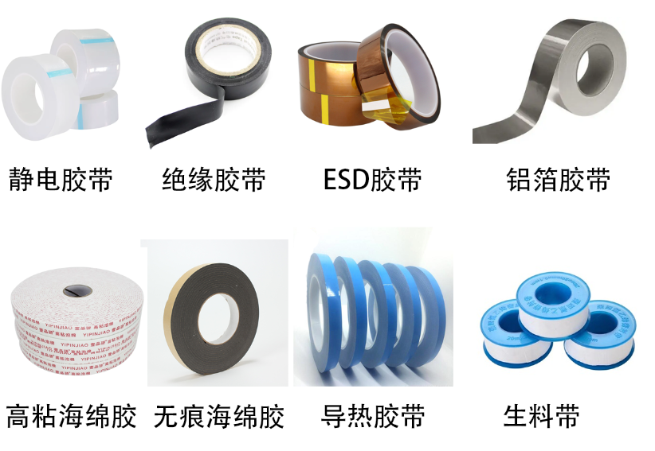

- **双面胶贴（得力纽赛牌）**：片状双面胶，性能很好，用途广泛

- **AB胶及结构胶**（粘东西，强度高，只能高温破坏性拆卸）、**铸工胶**（补漏洞和瑕疵）、**高透胶**（水晶滴胶，展示）、**AB硅胶**（翻模）
  
  找一个小型一次性培养皿，将胶按说明书上的比例加入（一般是1:1，3M的胶有胶枪），搅匀，涂抹到位并按压固定（一般几十分钟到几个小时后大致凝固，一天后彻底凝固）
  
  🔗 [3M手动胶枪正确使用方法](https://www.douyin.com/video/6887787375141948687)

- **热熔胶**：粘东西（强度相对较弱，但是用法十分多样），**用完一定要拔掉电源！**

- **速干胶**：502和401（不会有502的白色痕迹）

- **UV胶**：诺兰68/81号（用于Miniscope粘贴、光学粘贴、手术粘贴等，需要用368nm紫外手电固化，平时放在手术间抽屉中），绿油（用于电路绝缘保护，普通蓝光手电即可），UV高透树脂（水晶滴胶，还没买）

- **蓝丁胶**：用于临时固定小零件，遮盖小鼠头部窗口（性质类似口香糖）

- **亚克力胶水**：将两块亚克力在接触面溶并重凝结，在接触面用1mL注射器注入少量亚克力胶，等待挥发即可

- **其他**：电路板导热硅胶、B7000防水玻璃胶等

- **除胶剂**：柠檬除胶剂，喷上后用小铲子慢慢铲掉即可，有较大的橘子气味，应在室外操作

### 润滑油

- **缝纫机油（润滑油）**：用于精密机械（如N20电机减速器）等润滑

- **润滑脂（机械黄油）/凡士林**：用于较大的齿轮结构（如换向器）或粗糙物体（如3d打印件）的润滑

- **WD-40**：多用途取水/除锈/润滑剂，除特别说明外，很多东西都能润滑

- **螺栓松动剂**：如名所示

### 加热设备

- **电烙铁**：
  
  有两台电烙铁，一台同时有烙铁和风枪的功能，另一台功能更多，控温更准确
  
  1. 选择合适的烙铁头（一般用刀头或者普通尖头即可，备用件在桌面工具盒中），拧松并取下原有的，更换新的并拧紧
  2. 打湿海绵备用，打开老铁电源并按上下键设置温度（其他高级功能见说明书）
  3. 使用海绵擦拭烙铁头，如果烙铁头不粘锡则可以使用烙铁头清洁器（铜丝球）或烙铁头复活剂清洁，随后立刻挂锡
  4. **使用精细烙铁头时不要用力怼！很容易损坏！选择小烙铁头前先问下别人是否有特殊需求避免破坏尖端**

- **热风枪**：
  
  1. 选择合适的风嘴（一般用中口径即可）
  2. 打开电源，设置合适的温度和风速（风速一般默认4挡即可）（当前台子没法控制风速）

- **加热台**：
  
  1. 插上电源
  2. 按左右键切换，长按右键进入，长按左键退出
  3. 温度设置在设置中修改，或者加热界面长按右键更改当前预设值，可在三个预设值之间切换

- **烘箱**：
  
  1. 打开电源，按*Set*及上下左键 设定温度（*PV*显示*SP*，℃），再按*Set*设定时间（*PV*显示*ST*，minute）
  2. 再按*Set*退出，此时*PV*显示当前温度，*SV显示设定温度*，按上下键切换*PV*显示*TIME*，*SV*显示剩余时间
  3. 剩余时间结束后，烘箱**仅会报警，不会自动关闭电源降温！**

### 电路检测

- **万用表**：测量电压、电流、电阻、电容、二极管等
  
  🔗 [万用表的使用方法图解、使用口诀](https://zhuanlan.zhihu.com/p/672837624)

- **示波器**：检测波形
  
  🔗 [【示波器】小白快速入门教程](https://www.cnblogs.com/anliux/p/16823872.html)

---

## 电子设备加工

### 电路板定制

电路板设计是个高深的学问，不过好在我们基本上只需要画一些简单的转接板，使用`嘉立创EDA`即可完成设计（公共电脑上有）🔗 [嘉立创EDA专业版快速入门](https://prodocs.lceda.cn/cn/quick-start.html#%E7%BB%98%E5%88%B0pcb)

如果已有PCB工程文件（如KiCAD，打包成一个压缩包），那么可以直接从嘉立创下单：🔗 [嘉立创pcb怎么下单，smt下单，钢网下单等常见问题](https://www.jlc.com/portal/serviceGuide/order_guidance/service_type_technology)

SMT是指的让嘉立创帮你采购电子元器件并贴片，此过程需要一张BOM表（物料清单）和坐标表，如果没有的话，可以把PCB工程导入嘉立创EDA，里面应该可以看到并导出），如果手头有足够的元件且大致熟悉焊接的话可以尝试自己焊，这样就不需要STM了。

钢网是用来抹锡膏的，参见*焊接元件*章节，一般用不太到

- 下单PCB的过程中会有很多工艺让你选择，如果工程中没有特别说明，那么大部分保持默认即可，只有**板层层数需要注意选择一下**

- **下单STM过程中的的BOM匹配是个难点，会有一些无法自动匹配，需要你手动匹配**，有些你需要用BOM表中提供的原有编号确定那是个什么东西，然后去手动搜索（比如排针之类的常见玩意可能会分配一个奇葩的编号）
  
  如果是基础电子元件，你需要从中搜索**型号规格、基础参数、最大电压和电流**相同的元件，如果是连接器，则需要确认**公母、内外螺纹**，如果某些老芯片从商城中买不到，**需要你去自行比对新款和老款的区别**，或者**从淘宝等地方淘一些老货给嘉立创寄过去，或留空自己焊接**
  
  当然，你也可以选择花钱让嘉立创工程师帮你选型

**软硬结合板**比较特殊，嘉立创不加工，我们目前是从深圳胜翔订购的，具体需要和客服联系

### 焊接元件

一般来说我们不需要从头焊接所有电子元件，大多数时候只是为了焊接和维修部分设备，或者DIY一些无法进行插接的精密零件

需要要多练习，不是看了教程就能会的

⚠️ **注意防止烫伤，禁止加热设备空烧！及时关闭烙铁！**

- **教程汇总**
  
  基础知识：🔗 [《焊武帝养成攻略》零基础三分钟低成本精通焊接](https://www.bilibili.com/video/BV1STqpBqEa5/)
  
  烙铁焊接：🔗 [烙铁焊接速通教程_锡焊速成教学](https://www.bilibili.com/video/BV1vq3KeAEmC/)
  
  烙铁拆除：🔗 [《零基础学焊工》一个视频教会你各种拆焊的方法和技巧](https://www.bilibili.com/video/BV1xt7UzgEHv/)
  
  热风枪焊接和拆除：🔗 [新手焊接教程--热风枪焊接](https://www.bilibili.com/video/BV1tBgizbEUv/)
  
  加热台焊接和拆除：🔗 [【实战教学】DIY电路板：锡膏+加热台焊接与插件焊接全记录](https://www.bilibili.com/video/BV1QxWqzYEPy/)
  
  🔗 [回流焊是啥？新手可否一战？](https://www.bilibili.com/video/BV1Ff4y1C7JB/)
  
  飞线：一般用于维修PCB或者焊接脑电电极等特别细的东西，一般使用漆包线或者OK线，漆包线最好先烫掉两端的漆皮后焊接
  
  其他：🔗 [学会这10个技巧，让你变成焊接高手](https://www.bilibili.com/video/BV1ZK411K7D5/)

- **简要流程**：
  
  1. 使用ESD胶带、夹子和蓝丁胶固定好电路板，遮盖其他部分
  
  2. 确定好所用的焊锡和温度，预热加热设备，为电路板抹焊油
  
  3. 预热焊盘，新板给焊盘挂一层锡，旧板（在使用吸锡器拆除旧原件后）使用新锡拖过清理焊盘，随后使用吸锡带吸掉多余的锡
  
  4. 加热一个焊盘，并上锡，安装原件后待其冷却固定，随后依次焊接其他引脚
     
     如果某个引脚出现了锡过度氧化导致难以融化，可以使用新锡和吸锡器清理氧化物后重新焊接
  
  5. 使用无水乙醇清理焊盘
  
  6. 焊接完成后使用万用表检测有无短路/虚焊

### 接线

- **电线连接**：将两根导线断口接在一起
  
  🔗 [常用导线、电线连接方法、电工电线接线方法图解](https://zhuanlan.zhihu.com/p/550281370)
  
  1. 根据你的电线选择合适的接线方式
  2. 根据需要选择热缩管，**如果需要千万不要忘记套！**
  3. 将线按照预定方式接在一起：压接、拧接或焊接，其中焊接一般是在拧接或压接的基础上操作
  4. 如果需要焊接，则抹上助焊膏，预热烙铁头并挂锡，加热接头并推入锡丝
  5. 根据需要套好热缩管，并用热风枪100℃加热到其收缩到位；或者直接缠绕电工胶布

- **端子连接**：把裸露的导线接到连接器/PCB上
  
  注意使用区分不同引脚，不要接错！一般来说外壳接地
  
  - **螺钉端子**：将线头整理好，拧松螺钉，插入线并拧紧即可，可以与*针式冷压端子*结合
  
  - **直式焊杯**：🔗 [电线与终端焊接操作](https://www.bilibili.com/video/BV1oP4y1G7SW)
  
  - **焊盘连接**：🔗 [导线焊不住，因为你缺少了这一步](https://www.bilibili.com/video/BV1mN411k7GM/)
  
  - **焊接端子**：🔗 [干货分享：开关的三种焊接方法](https://www.bilibili.com/video/BV1iXBjBvEgw/) 或者使用弹簧直插端子（见*U形冷压端子*）
  
  - **针式冷压端子或圆形套管**：将线从穿入，然后用压线钳再不同位置压紧多次即可
  
  - **U形冷压端子（叉形、双U、簧片端子等）**：将电线穿到目标位置，用压线钳或老虎钳压紧即可，参考🔗 [做杜邦线（假）教程](https://www.cnblogs.com/vinccc/p/8408562.html)
    
    如果有1个U形，如果电线较粗则用其直接固定电线即可；如果电线较细，则可以用其固定胶皮，然后将线焊接到端子其他位置
    
    **杜邦线、XH、SH等不同接头的端子不同，不能相互通用**，注意区分（不过一般也不需要，直接使用现成的即可。
  
  - **同轴线端子**：同轴线比较特殊，是一种负极导体网包裹正极的结构，如果需要保持较好的完整性应使用专门的端子，但是普通情况下则没那么重要
    
    🔗 [复杂同轴怎么安装？这份攻略请收好](https://zhuanlan.zhihu.com/p/663598312)
  
  - **自制转接板**：
    
    可以根据你所需的零件自行设计！

- **连接器**：可拔插的接线器件
  
  连接器一般包括插头和插座，可以**插头→插座**连接，其中母座用螺栓安装在机箱上，插头可以载入导线上，也可以**插头→插头**连接，其中插头连接在导线和终端设备上（见*机箱*章节）
  
  部分母座是没有负极的，找一个带焊片端子的垫圈然后用螺栓拧上去即可！这些线路的外壳是接地的；
  
  插头大部分需要拆开焊接，不要忘记先把线穿进去再焊
  
  **焊接的时候注意接口的对应关系！不要连错！**
  
  - **2.54mm 方针排针、排母**：最基础的插接件，有多种不同的组合方式，可以根据需要选用
  
  - **跳线（杜邦线、面包板跳线、跳线帽）**：基础的连接线，其中杜邦线最常用**注意杜邦线插入孔洞后不要随便旋转扭动，会损坏簧片造成接触不良！**
  
  - **圆形排针、排母**：常见有1.27mm、1mm、0.5mm等多种间距，多用于电生理记录等小尺寸、频繁拔插的场景，**没有防呆设计，注意不要插反！** 其不能适配杜邦线等其他接头！
  
  - **面包板**：一类用于连接多条杜邦线或跳线的工具，图中所绘制的线内部是接通的，可以非常方便的分线、并线、统一供电等，插接的电子元件（如LED和电阻)也可以由此连接，**下图中绘制线条的孔洞之间是相互连接的！**
    
    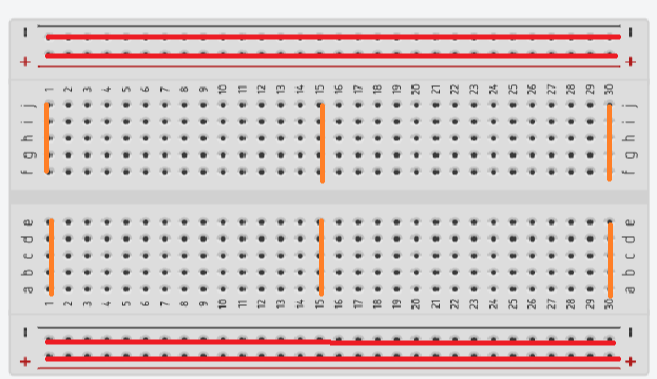
  
  - **JST接头家族**：有很多不同型号，大多数有防呆设计，多用于相对供电等相对固定的线路，根据需要选取即可 🔗 [SH、MX、GH、ZH、PH、EH、XH、VH 等系列端子线的区别与作用](https://blog.csdn.net/2403_87830841/article/details/145506126)
  
  - **DC接头家族**：有多种不同型号，能承载大电流且与外界绝缘，多用于各种设备供电、连接泵和照明灯等，**最常用的尺寸为5.5*2.1mm**
  
  - **BNC接头**：多用于连普通双线传感器和设备，**有多种分线头和转接头可使用**，常用`公头端子`+`母头底座`
  
  - **航空接头或XLR（卡侬）接头**：一般为多芯接头，多用于连接多路设备或者一次连接多个设备，其中卡侬头有标准XLR和MiniXLR两种；航空头有一系列不同直径（如GX16代表直径16mm），用于连接多路设备或多个设备
  
  - **SMA接头**：多用于连接高频设备（如Miniscope）**注意！SMA有端子/底座+公/母（针/孔）+内/外螺纹（螺丝/螺母）共8种不同形式！** 最常用的是`底座+外螺纹+母头`和`端子(或自制转接板+底座+内螺纹+公头`
    
    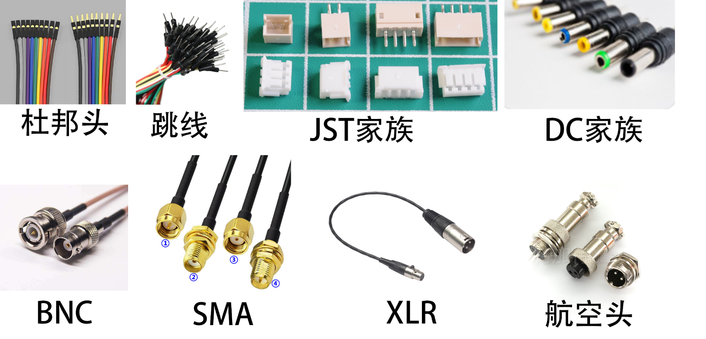
  
  - **IPEX MHF1/U.FL 接头**：现在有两种不同的接头，对应不同的连接方式。**注意IPEX一共有5代！Miniscope用的是第一代！** 注意 **IPEX接头仅能进行30次左右拔插！频繁拔插会损坏其底座！** 尽管底座和接头损坏后可以更换，但是总归还是小心一点好；组装/焊接好之后在上面涂一些绿油（见*胶水*章节）固定
    
    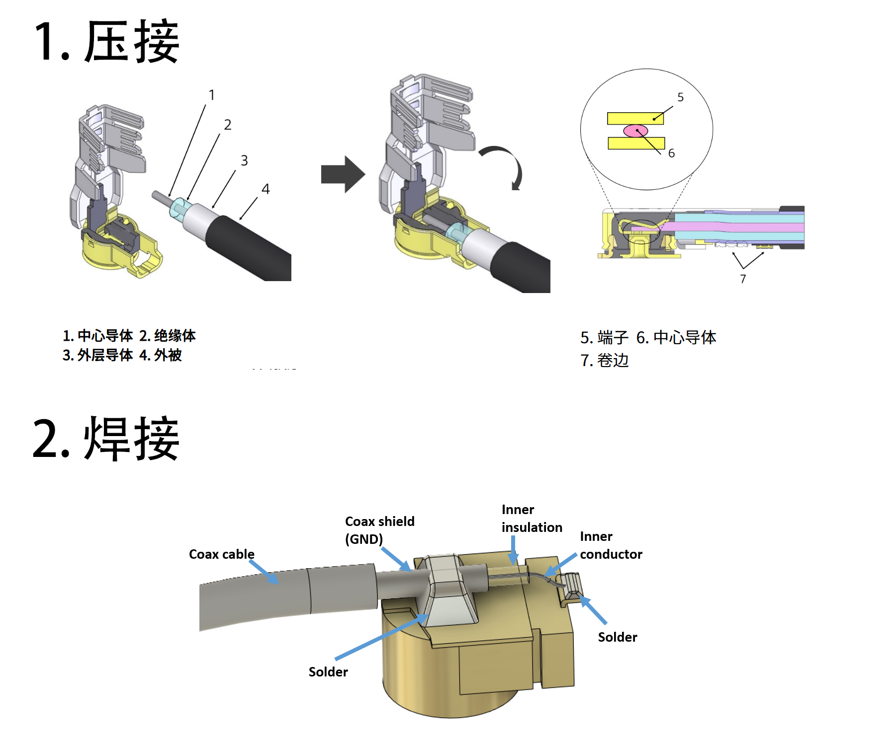
  
  - **USB接口**：
    
    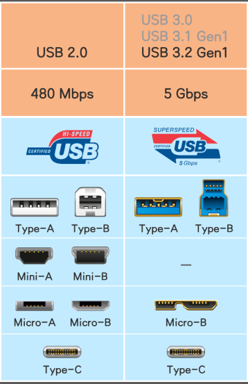
  
  - **各种显示接头**：这部分比较复杂，详见链接 🔗 [HDMI、VGA、DP、DVI常见视频接口知识分享](https://zhuanlan.zhihu.com/p/397364722)
  
  - **香蕉/灯笼头、鳄鱼夹、钩子头等**：一般用于万用表和示波器检测或测试，放在表笔抽屉种
  
  - **其他**：世界上接口千千万，需要的时候再查询

- **导线**
  
  - 有普通双芯、多芯线路，带屏蔽/不带屏蔽等区别
  - 同轴线基本只在miniscope、wifi天线等高频信号传输场景上使用，其他场景等于普通双芯线
  - 注意线径以及功率匹配，大功率场景用更粗的线

### Arduino 及 ESP32 开发板

- **基础介绍**：
  
  Arudino是一类开源的单片机开发板，能读取和输出模拟和数字信号，可以通过插接连接各种模块化电路而实现不同的功能
  
  此处常用的有Due（功能复杂，昂贵），Mega2560（最常用，接口多），Uno（和Mega差不多，但是接口少一些），Nano（非常小，可以插到面包板上）
  
  ESP32跟Arduino类似，但是增加了WIFI等联网功能
  
  Arduino平时可以插在电脑上，并且使用串口与电脑通信，但是其也可以通过电源供电而独立工作
  
  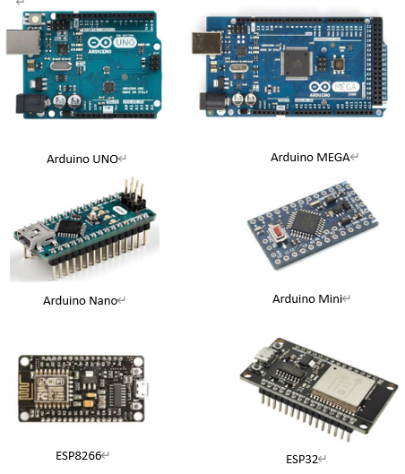
  
  模块化电路（电子积木）介绍：🔗 [第三章 常见电子积木模块的简单使用 - 《Arduino入门教程》](https://geekdaxue.co/read/nicheng-yk7a1@yq6u33/pkps07)

- **接口**：俗称Pin口
  
  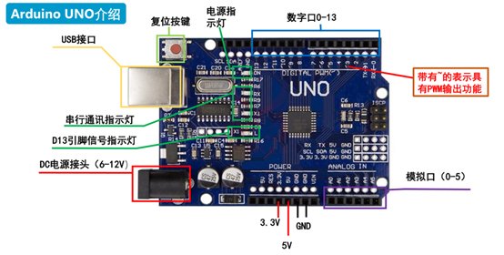
  
  - 标有`DIGITAL|数字`或`D数字`的是普通引脚，只能读入（INPUT）或输出（OUTPUT）两种状态——高电平（5V / HIGH） 或 低电平（0V / LOW）。用于读取开关、驱动继电器、点亮普通 LED等。
    
    引脚处于INPUT状态时，可以设置其为默认模式或上拉（INPUT_PULLUP）模式，这样当其悬空（未连接）的时候，其会稳定的读入HIGH，如果没有开启的话读到的信号则有会随机跳动
  
  - 标有`PWM|数字`或``数字`的是PWM引脚（脉冲宽度调制），也被称为analogWrite，具有再不改变电压的情况下调节输出功率的作用。用于调节LED亮度、控制电机转速等。
  
  - 标有`ANALOG|数字`或`A数字`的是模拟输入引脚，可以读取0-5V的连续的电压变化并将其转化为0-1023的输出。用于读取电压大小、光线强度等模拟信号，不建议用作输出
  
  - 标有`3V3`，`5V`和`GND`的是供电引脚，可以输出对应电压，也可输入电压为板子供电（不推荐，容易损坏）。一个板子上可能有多个此类引脚，彼此之间是相互连通的
    
    注意在连接多个元件和Arduino的时候，一定要确保其`GND`引脚连直接或间接在一起！（共接地）
  
  - 标有`RST`接口在接地的时候会让板子重启
    
    **关于PortC**：LogEvent中会使用*Arduino Due*中的这类接口，即下图中的黄标为PC+数字的接口。其中的数字就是*PC号*，例如图中箭头指向了D9—PC21，代表9号Pin口的PC号是11。有的接口时属于PortA/B/D组的，并不能被LogEvent记录。
    
    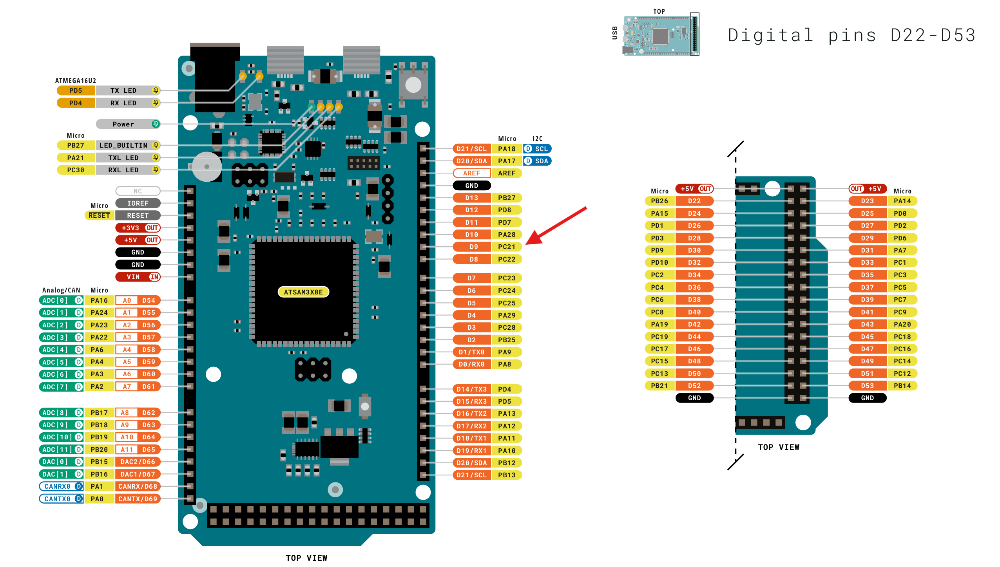
  
  **关于编程口和原生口**：Arduino DUE的USB口有两个，**上图左侧靠近DC接口的是编程口（Programming Port），右侧的是原生口（Native Port）**，刷写程序需要使用编程口，而交互使用两者皆可（native USB接口可以实现模拟鼠标键盘等USB接口功能，而编程口只能进行串口通信）

- **Arduino IDE**：（公共电脑里面有，如果经常开发可以自己下载一个 🔗 [Arduino IDE](https://www.arduino.cc/en/software/)）
  
  Arduino的代码以C语言为基础，有相关经验的可轻松上手
  
  🔗 [【太极创客】零基础入门学用Arduino 第一部分 合辑](https://www.bilibili.com/video/BV164411J7GE)
  
  学习时可以先了解基础，首先确保能结合注释看懂代码，程序编写可以一定程度上求助于AI，只要自己对任务的表述足够清晰完备，绝大多数情况下正确率很高，但也会偶现错误，需要自身具有一定的代码阅读能力。
  
  - **如果你只希望使用/刷写现有代码**，则可以：
    
    1. 在公共电脑里打开代码（`ino`文件），点左上角的滚动条并选择你的板子（如果不确定串口号可以通过拔插来确定），然后选择板子对应的型号
    
    2. 点击`对勾`，如果没报错就点击旁边的`箭头`开始上传
    
    3. 如果报错了，则看一眼报错信息里面有没有类似`Cannot find xxxxxx.h`的信息，然后去左边`书架`图标里面搜索安装（例如`DueTimer.h`就去搜索`DueTimer`，可能会有库名称和头文件名不同的情况，注意看库的来源）
       
       如果没搜到则回去查看有没有项目说明，或者尝试网络搜索相关信息
    
    4. 上传完成后，点击右上角的`放大镜（串口监视器）`即可跟板子通信
    
    5. 通信的时候注意选择波特率（默认是9600），如果使用原生USB端口则无需考虑波特率，波特率在代码中会写，可以搜索`Serial.begin`，里面括号那个数字就是波特率，如果那里的是一串字母则可以按住`Ctrl`键点击那个字母，会自动跳转到其真实数值
    
    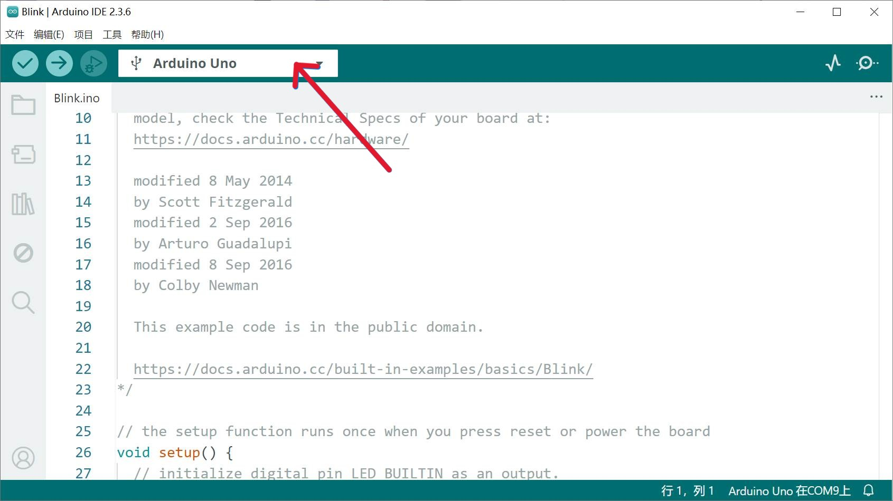
  
  - **串口调试软件**：
    
    Arduino IDE有串口通信的基础功能，但如果你需要一些高级功能（比如将指令简为按钮），或者你没有安装IDE，那么可以安装一个串口调试软件
    
    💡推荐`LLCOM` 🔗 [GitHub - chenxuuu/llcom](https://github.com/chenxuuu/llcom)，本身功能比较完善，还可以用Lua编写自动处理发送和接收的信息，比如可以用来给你推送提醒（见*软件使用指南*）
    
    也可使用python等语言实现串口通讯
  
  - **库文件的位置一般在以下位置**
    
    Windows：`文档\Arduino\libraries`
    
    MacOS：`~/Documents/Arduino/libraries`
    
    如果需要安装的话，把库文件夹copy进来即可！

- **注意事项**
  
  Arduino的对外供电能力很有限（最大40mA，稳定20mA）！**驱动泵或灯等大功率设备时，请使用继电器！**
  
  除DC供电（7-12V）接口外，不要向Arudino各Pine口输入超过5V的电压，不要向Arudino DUE输入超过3.3V的电压！

### 基础元器件

基础电子元器件已经有相当多的教程/课程了，请大家自行学习

**注意事项**

- **开关**有多种不同的工作模式，可以自己测试一下以作区分！以下是一个例子
  
  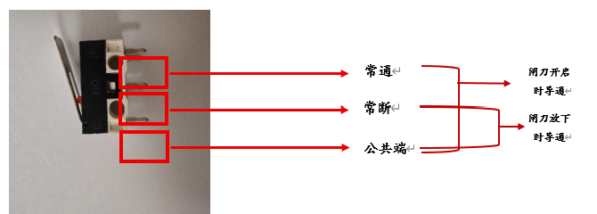

- 常见LED小灯泡的工作电压是3.3左右，但是Arudino的输出电压是5V，连接的时候请添加一个1kΩ左右的电阻！

### 传感器和执行器

- **电容触摸板**：用来感应小鼠的接触（如舔舐/四肢触碰），使用AT42QT系列芯片的触摸板，不要使用TTP223系列（容易误触）
  
  部分触摸板上有LED，可以把板上的跳线切断（板身上有说明），同时确保不要使用低功耗模式；可以在OUT和GND引脚之间焊接一个100nF小电容以滤波
  
  使用方法：触摸板+水嘴紧固件+水嘴（可灵活调整，如使用亚克力片隔开水嘴与触摸板降低敏感度等）
  
  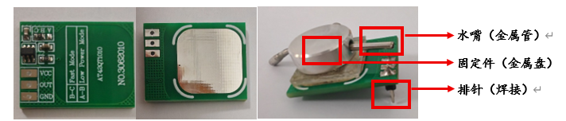

- **继电器**：通过低电压电流（Arduino输出信号）驱动大电压大电流（9-27V电源输出），支持一般频率的PWM
  
  **注意！继电器的输出线请勿接地！！连接时请使用绝缘BNC接头或DC头！**
  
  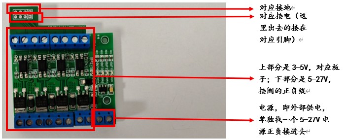

- **电磁阀/压管阀**：控制液体的设备，**不同产品的控制电压不同！请使用对应电压的电源和继电器！**
  
  阀在工作时会发热，**不要连续开阀10分钟以上！**，万一忘记关闭导致其长时间开启，则需要冷却一天后再使用，在此期间其行程和响应速度会发生变化，导致控制失准。
  
  压管阀有需要使用压管阀专用硅胶管（需要咨询），其他连接信息见*水管*章节

- **电动机、蠕动泵和注射泵**：大部分电动机（马达）可以经过继电器通电使用，但是步进电机需要用特殊的驱动方法！🔗 [1、步进电机介绍以及原理 - 孤情剑客](https://www.cnblogs.com/The-explosion/p/15797675.html)，常见两相四线电机
  
  注意：**步进电机有多种型号，驱动电压、相数和线数不同的电机控制方法不同，不同的步进电机每一圈的步数也不相同** 可以使用对应相/线的控制板（如两相四线使用的A4988系列）或查找资料手写驱动
  
  注射泵有多种型号，使用方法各不相同，请阅读说明书

- **其他**：不太常用/没有特别的注意事项的就没写，查询对应使用说明即可！

### 摄像头和照明

- **照明**：使用淘宝购买的红外灯即可！

- **普通工业摄像头**：淘宝购买，**注意红外补光须搭配红外摄像头**，有不同焦距（视角），可以多买一些进行测试

- **Basler（宝视纳）相机**：目前使用的型号是acA1440-220um（还有一个220uc，彩色输出），使用2 × M2+1 × M3螺丝固定，架子根据自身需求设计和打印
  
  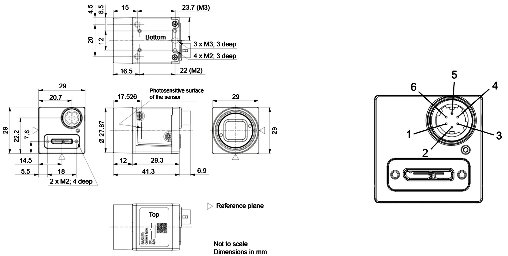
  
  | 引脚  | 线路     | 功能                 |
  | --- | ------ | ------------------ |
  | 1   | Line 3 | 通用 I/O (GPIO) 线路   |
  | 2   | Line 1 | 光电耦合 I/O 输入线路      |
  | 3   | Line 4 | 通用 I/O (GPIO) 线路   |
  | 4   | Line 2 | 光电耦合 I/O 输出线路      |
  | 5   | -      | 光电耦合 I/O 线路接地      |
  | 6   | -      | 通用 I/O (GPIO) 线路接地 |
  
  这种接头及连接线可以在淘宝上购买，将`Line3`和`通用 I/O (GPIO) 线路接地`两条线路连接到Arudino板的`12`和`GND`接口并在软件配置后即可实现硬触发（参见*软件使用指南*），其他线可用于帧同步等，按需配置
  
  镜头可以淘宝购买C口工业镜头，可以多买几种不同焦距/光圈的镜头测试一下是否符合需求
  
  长时间使用请为相机安装散热片！

### 机箱组装

淘宝搜索机柜机箱，高度1U（1.75英寸），短款（深250mm），宽19英寸（标准机架尺寸，含安装耳），材料为铝合金+阳极氧化发黑，具有绝缘能力，

机箱需要自己动手组装，组装完成后通过**卡式螺母**安装到机柜上，或者找个安全的地方放好

- **机箱开孔**
  
  机箱一般在前后面板上开孔：前面板一般连接按钮、指示灯、传感器和执行器接口；后面板一般连接Arudino接口及各种电源线
  
  💡前面板开孔推荐：1 × 通用方孔（可自行3d打印适配器），12 × 圆孔（小直径设备可以通过垫圈兼容大孔，推荐2+7+2+1），3 × LED孔
  
  💡后面板开孔推荐：3 × Arduino方孔，1 × 通用方孔，7 × 圆孔
  
  具体尺寸见CAD图纸，位于📁`models/机箱开孔.dwg`
  
  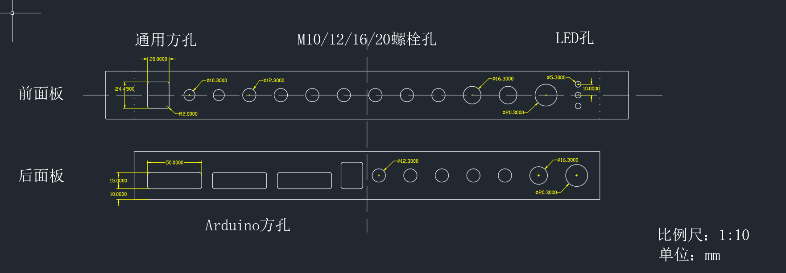

- **设备安装**
  
  将设备用魔术贴/无痕海绵胶条（可拆卸）或永固海绵胶（不可拆卸）贴到机箱内即可，各种插座找合适的螺栓拧上去即可
  
  💡推荐连接逻辑如下图：
  
  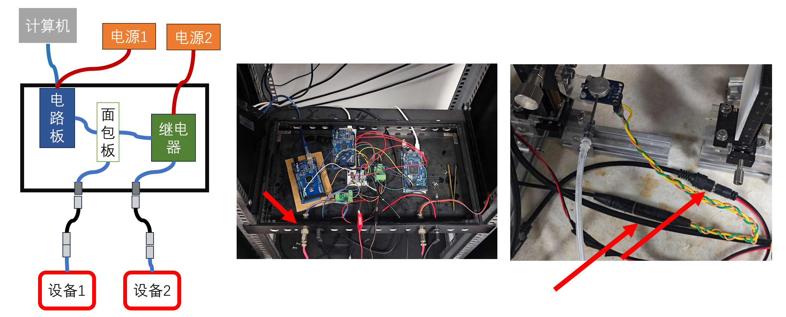
  
  这样可以方便的拔插终端设备，或更换连接线

- **供电**
  
  - Arduino大多时候使用USB供电即可工作，但是如果电脑上USB设备插的太多则会引起供电不足！（如在实验中板子反复重启、卡死，常见于*LogEvent*），此时则需要单独供电
  - 不同电压的设备应当分开供电；电压相同的情况下，一个电源可以为适当数量的Arduino/继电器供电，但是**红外照明灯必须使用单独的电源**，否则会产生严重的噪声干扰
  - 大部分电压相同的小功率设备可以统一使用Arudino→面包板→设备的供电路径，如果有多块Arduino，则只需其中一块向面包板供电即可

- **接地**
  
  - 所有Arduino和Miniscope等终端设备的地线（GND）都要接在一起，但是继电器输出端除外！继电器的输出端比较特殊，在没有开启的时候两个引脚都是高电平，开启时会下拉其中一个引脚
  - 阳极氧化的铝合金机箱大概不会导电，但是引脚最好还是不要碰到机箱
  - 金属行为箱最好也要接地，可以通过鳄鱼钳、叉形冷压端子等连接到机柜上，随后再通过接地插座连接到地线

---

## 机械结构设计与制作

### 绘图与建模

公共电脑上有！

- **Inventor**：机械建模软件，最有想象力的一集，可以绘制几乎所有常见规格的所需部件，满足在亚克力板和铝型材上固定非标准零件的需求
  
  🔗 参考教程：🔗 [inventor2021入门详解(每个功能会有一个短视频)(174集 已完结)](https://www.bilibili.com/video/BV1744y1m7TG)。实际学习时**不需要全部学完，理论上学完基本形状和拉伸（反向拉伸即为开孔）等简单步骤**之后，就可以胜任九成九的所需建模任务，剩下的就是巧妙地规划和设计一个你需要的模型了。**完成建模之后，请使用`文件/打印/发送到3D打印服务`将自己的文件另存为.stl格式，这种格式可以直接进行打印（但不可修改，请注意留档）**，如果有多个零部件，则可以隐藏其他，逐一显示并保存
  
  如果你有CAD基础，上手会相当快
  
  如果需要螺纹，则可以提前留孔用以攻丝（见*电动工具*章节）或使用热熔螺母，不要直接打印螺纹

- **AutoCAD**：强大的工业绘图软件，主要是绘制图纸，但是其实很多简单的结构用Inventor建模甚至手绘图纸，然后发给淘宝客服就能加工

### 塑料件（3D打印）

现在我们有热熔堆积（FDM）和光固化两种打印机

前者可选材质多，打印速度快、使用方便；后者目前使用`Elegoo ABS like 3.0`打印精度高，打印件结构强度高且耐热（不可使用热熔螺母）

**主要流程**：

1. 建模
2. 导入切片软件（公共电脑上有！）
3. 拜访模型，添加支撑
4. 调整参数，切片
5. 检查打印机
6. 发送打印！
7. 回收模型并清理残渣

**具体使用方法**

- **FDM（Bambu A1+AMS Lite，切片软件为Bambu Lab）**
  
  使用方法：🔗 [A1 初次打印指南（使用 AMS lite） | Bambu Lab Wiki](https://wiki.bambulab.com/zh/a1/manual/first-print-with-ams-lite)，其他功能详见wiki
  
  自动换盘器：可以自动连续打印多盘零件，具体见📁`file/打印机自动换盘`
  
  注意事项和提示：
  
  - 💡**最好大底面朝下打印，这样更稳固**
  - **打印前请检查托盘和耗材情况！打印后请清理垃圾并复位！**
  - 最常用的喷嘴尺寸为0.4，打印前**请检查目前打印机上安装的喷嘴直径是多少！** 我们目前有0.2，0.6，0.8各一个，0.4两个，并且还有两个0.2的备用喷头，放在抽屉里的盒子中，可以由此确认机器上安装的是什么
  - 除了PLA外的耗材都需要干燥，**不用的时候请放入干燥箱！** 用的时候请扣好AMS上的盖子并检查里面干燥盒内氯化钙的量
  - 💡**放盘子的时候一定要让盘子压住换盘器的尾钩！**
  - 如果对悬空的底面质量有较高要求，可以在`支撑——支撑/筏层界面把材料切换为另一类材质，并自动变更其他设置（如主体是PLA，则界面可以是某种PETG，反之亦然）
  - 💡此台打印机的打印过程底板会前后运动，薄壁结构不要放在这个方向上

- **光固化（Elegoo Saturn 4 Ultra 放在通风厨中，切片软件为ChituBox Basic）**
  
  🔗 [【干货】必看！光固化3D打印入门扫雷之新手保姆级指南](https://www.bilibili.com/video/BV1Bty2YjE5g)
  
  🔗 [教程丨爱乐酷-如何使用光固化3D打印机](https://www.bilibili.com/video/BV1oMtqzSEAz)（注：没必要抽壳倒是）
  
  使用方法：基础功能请阅读说明书，切片软件：🔗 [快速上手 | CHITUBOX 文档](https://docs.chitubox.com/zh-CN/chitubox/latest/quick-start)
  
  与FDM不同，光固化打印的模型需要后处理：
  
  1. 铲下模型，丢到旁边固化清洗机的酒精桶的铁丝网里面，然后拿掉托盘，把桶盖好盖子放上去
  2. 点击切换至"水滴"模式，定时3分钟，运行结束后把铁丝网连同模型去除沥干
  3. 把托盘放到固化清洗机上，把模型摆上去，盖上黄色盖子
  4. 点击切换至"水滴"模式，定时3分钟，运行结束后去除并拆除支架
  5. 1-2天后模型彻底固化
  
  注意事项和提示：
  
  - **树脂有一定毒性且难以清洗，请戴手套操作！**
  
  - 打印前请搅匀料槽内树脂并**检查料槽内有无残留物！** 具体方法是使用塑料铲子搅拌并沿离型膜轻轻铲动。如果发现树脂中有异物，请用筛网和漏斗过滤料槽内树脂（倒回瓶子）；如果发现树脂中有异物，请用筛网和漏斗过滤料槽内树脂（倒回瓶子）；如果发现离型膜上有附着的塑料，请使用打印机`工具/料槽清理`的功能，完成后请铲掉底面整体塑料片，并丢入身后桌子下的水槽中
    
    **打印后也务必进行项检查！**
    
    **光固化的模型一般不贴底打印，而是边或角朝下打印**，不然其打印悬空的大平面的效果会很差，而且模型会很难拆下！坏处是模型对称性可能会没那么好  
    
    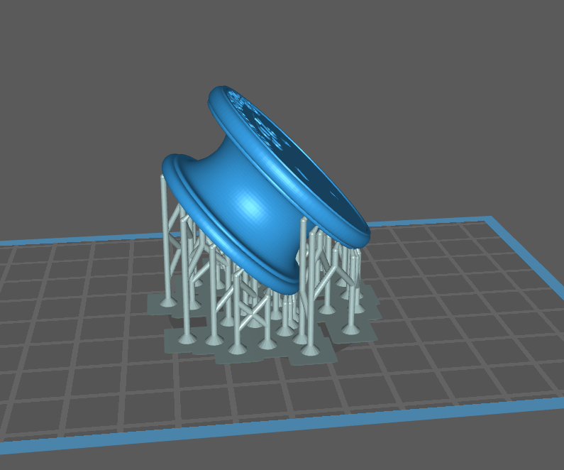

- 如果发现打印件尺寸明显偏大/偏小，或者更换了其他树脂，请重新校准曝光时间！[彻底看懂如何精确找到曝光参数，再也不用抄作业啦](https://www.bilibili.com/video/BV1vp4y1J7g9) 测试文件在`models/打印测试.stl`

- 打印时模型重量分布最好均匀一些！

后处理：

- 打磨修形

- 攻丝

- 涂色（如果是做玩具）

### 紧固件

紧固件是用来把一堆其他零件拧到一起的零件，比如各种螺丝螺母

- 螺丝：常用螺丝大部分为内六角螺丝，**有多种不同直径和长度**，也有多种头部，最常用的是圆柱头（杯头）
  
  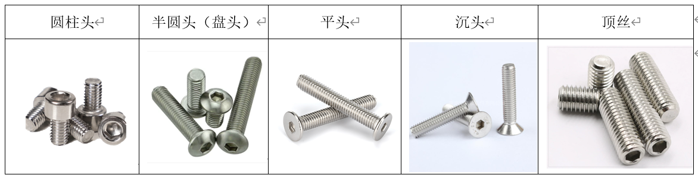

- 螺母：常用螺母为六角螺母，有普通防松需求可以防松螺母，需要拧得紧且防松可以选齿面法兰螺母、要求手拧可以选蝶形螺母，两种T形螺母为铝型材专用，热熔螺母是通过电烙铁加热螺母并烧入塑料使用
  
  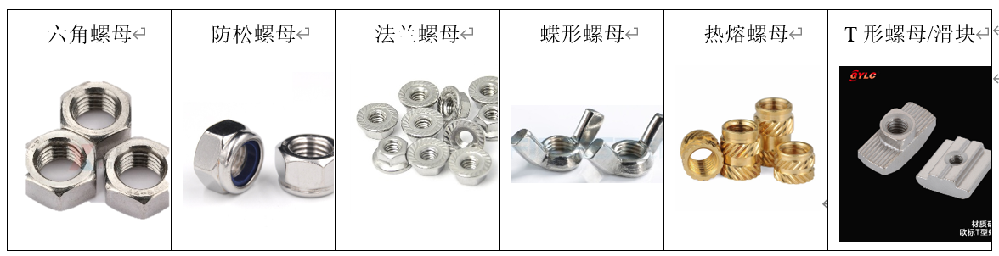

- 垫圈：有平垫圈和各种弹簧垫圈分散受力、防止划伤零件表面，按理来说，除了法兰螺母外，其他需要旋转拧紧的面、承力的的平面下面都要安装。

### 亚克力板

常用的面材料，一般用来做行为箱的墙壁，或者方便加工的板材（用来固定相机等设备）和垫片等，一般购买商家为淘宝简川旗舰店

有透明、黑、白、半透明、各种彩色等多种颜色。一般来说，5mm厚及以上的亚克力比较坚硬，适合用来制作行为箱的壁，而2mm以下的则比较软，可以一定程度的弯折，但是不可食用（？？？）

也有其他包括圆柱、实心柱、球等曲面结构件可供选购

- 加工方式
  
  亚克力应该在购买的时候就设计好所使用的形状，并让商家切割后发货，但是我们仍然能能在实验室内进行一系列小规模加工：
  
  - 使用钩刀（薄板）或使用线锯（厚板）切割
  
  - 使用台钻、直磨机打孔和扩孔，及使用丝锥攻丝（见*手动工具*），或者植入热熔螺母
  
  - 在台钳上固定，使用热风枪在150℃下吹软后用其他压克力板或金属板辅助弯折到指定角度，待其冷却定型后撤掉其他辅助零件即可；也可使用台钳压出⚡形的零件
  
  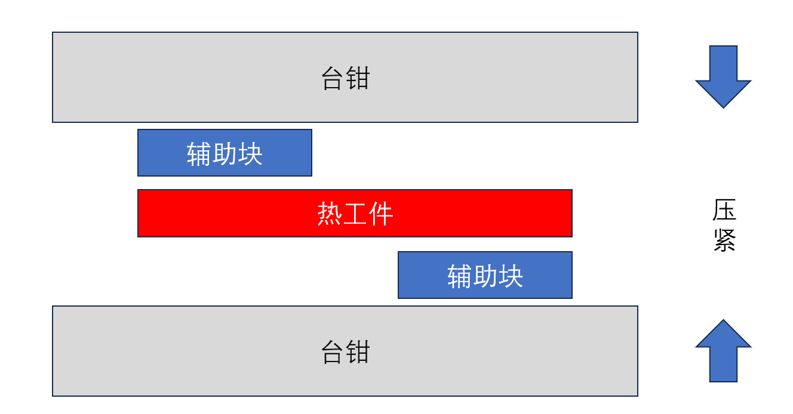
  
  - 使用砂纸和锉刀打磨

- 连接方式
  
  - 打孔，随后螺丝固定
  
  - 卡在两根铝型材中间，并用热熔胶或其他胶水固定，或用其他紧固件拧在铝型材上
  
  - 使用亚克力胶或其他胶水粘贴两个面
  
  - 使用90°弯折的亚克力作为连接件粘贴两个垂直面，随后用热熔胶或其他胶水封闭其余缝隙

### 铝型材

常用的骨架材料，常用规格为欧标2020、3030、4040（即宽度20mm、30mm、40mm），也有2040等`1x2`并联结构的，一般购买商家为*佛山欧贝睿*

铝型材上有梯形凹槽，标准件工具柜大部分长成这个形状的零件都是用来安装在铝型材上的。（国标欧标大部分紧固件不通用）

- 连接方式
  
  除了螺丝外，一个重要标准件是T形螺母（也叫铝型材螺母），其可以直接从槽种放入铝型材导轨，随后在用螺丝将其他零件拧上来，在此过程中其会自动旋转90°并自锁，同样松开后可以从槽中直接取出。**使用时应检查：拧紧后螺母是否确实横过来了**。
  
  另一种是滑块，只能从铝型材两装入，拧松后可以在铝型材上移动而不会脱落
  
  还有一种是槽件（例如滑轨）+顶丝，其拧紧后会被顶在铝型材内卡住
  
  [20种铝型材的连接方式](https://zhuanlan.zhihu.com/p/365552444)
  
  这里着重介绍：
  
  - 角码：有对应铝型材的20,30,40规格，用于连接两根铝型材。注意：常见角码两个平面上均有小凸起，可以卡在铝型材缝隙中防止大角度转动
  
  - 角件：功能类似，但要注意两边的形状是不一样的！
  
  - 合页：可以活动，用来制作门
  
  - 滑轨：可以用来在铝型材中滑动，也可用来头对头连接两跟铝型材1
  
  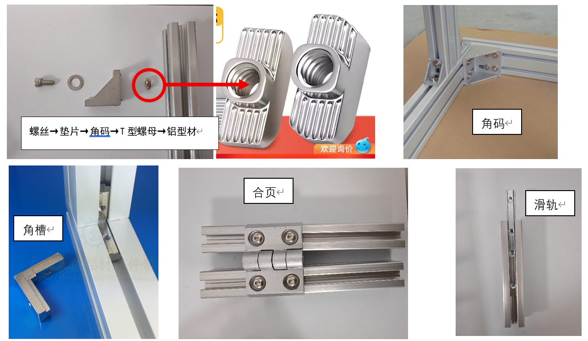

- 加工方式
  
  - 锯断：推荐使用固定到角磨机，也可以手锯（见*电动工具*和*手动工具*）
  
  - 打孔和攻丝：可以自己用台钻和丝锥加工，也可以让商家代加工，**30及以上中心孔攻牙较困难不要贸然尝试**
  
  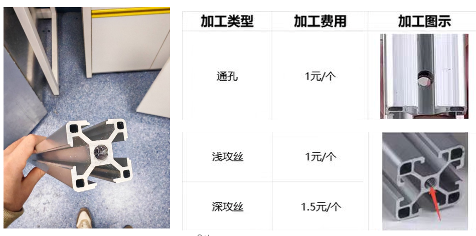

### 光轴

光轴是指光滑的轴，不是指光学系统中轴，也不是指键盘

- 光学面包板：一种有很多螺丝孔的金属板，是很多防震台的默认台面，可以用顶丝在上面安装光轴（如果顶丝尺寸不合适可以寻找螺丝套筒进行转接）
  
  注意防止进脏东西！很难清理

- 光轴：一系列不同直径的金属杆，两端有螺丝孔，可以进行末端固定

- 光轴连接件：一系列不同形状的套筒，可以把光轴连接起来，拧紧可固定，拧松可滑动

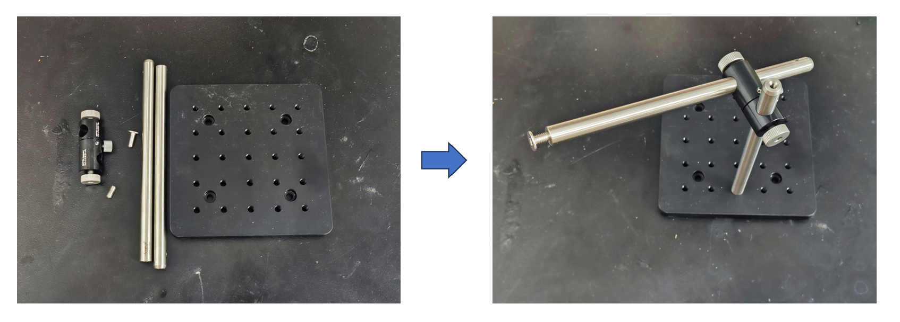

### 位移台

位移台种类和尺寸很多，并且彼此可以一定程度上相互组合，如果精度和尺寸需求高（如：手术使用），则可以购买ThorLabs的；如果需求较低（调整水嘴位置等），则可以找联合光科、大恒光电等国产的，或直接淘宝搜索购买

常见的有电动和手动的

- 平移台：一般有螺杆式/顶丝式（精度高，有的带微测头）和燕尾槽式的（行程大）

- 旋转台：基本上都差不太多

- 倾斜台：一般用圆弧导轨式，还有一种顶丝式（结构紧凑但是精度差，可活动角度小）

- 升降台，有的和竖起来的平移台平移台差不多（但是那样安装面就是垂直的），还有交叉滚柱式（精密）及剪式（常见，精度比较差)相似尺寸的位移台之间一般可以相互转接，或者可以直接购买组合件

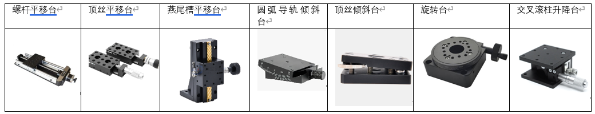

### 水管

实验中一般使用硅胶水管输送流体，常用2*4mm水管，也有多种其他直径的

水管有多种转接头和分插头，可以连接、转接、分合流；也有调速器（安装在一次性输液器）、阀/夹、三通阀等控制设备，及鲁尔头（终端连接）

其中**鲁尔头母端可以用来连接注射器（或其他储水容器），公端可用于连接灌胃针（水嘴）**

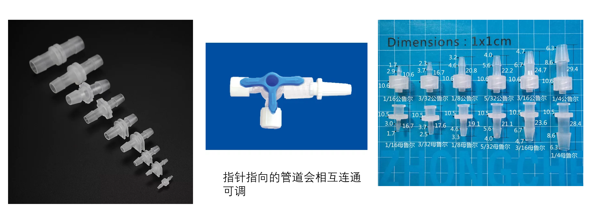

---