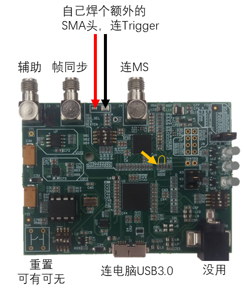
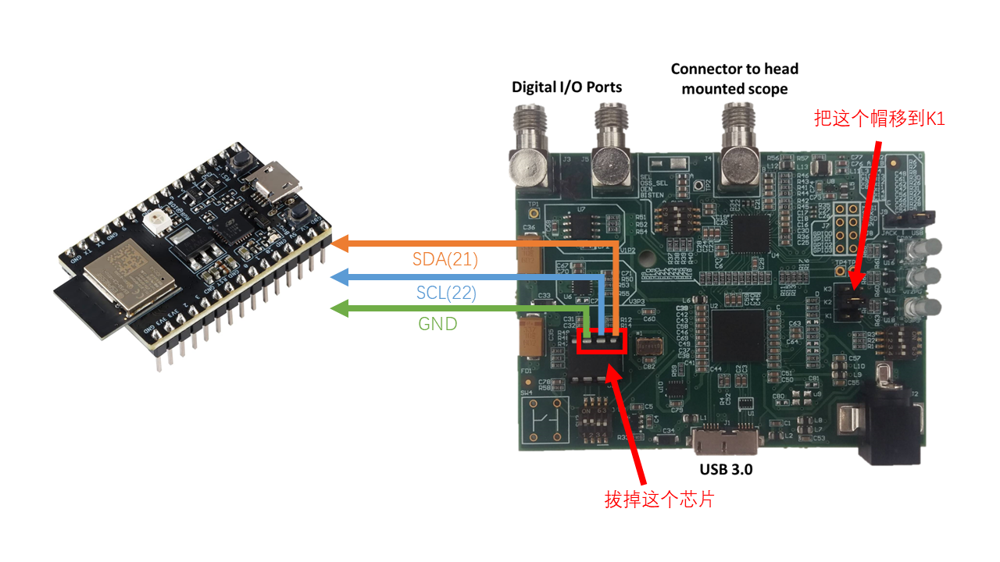

# 设备使用指南

本文中提到的部分路径是基于📁`/mnt/HDD1/archives`的相对路径，如📁`files/example`或📄`models/example.stl`

---

## 简介

- 本文件主要用于帮助用户熟悉目前实验室内主要实验设备的使用与维护方法
- 使用工具前请**务必阅读使用说明**及**学习使用方法和注意事项**

---

## 冰箱存放列表

**4℃冰箱**

**-20℃冰箱**

**-80℃冰箱**

**4℃冰箱**

**双开门冰箱**

---

## 荧光共聚焦显微镜

---

## 双光子显微镜

---

## Miniscope 微型显微镜

### 设备连接

在正式试验记录中，一般需要连接Miniscope本体，Trigger线（拉高开始记录，拉低停止，见[*软件使用指南/Miniscope 录制程序/Miniscope 操作流程*](软件使用指南.md)），帧同步（记录每一帧的时间戳，上拉和下拉跳变都代表一帧，所以其从示波器上看到的帧率是真实帧率的一半，比软件记录精度要高一些），左边这个辅助接口暂时没用

其中Trigger线需要自己想办法，要么如图红黑线所示自己焊一个额外的SMA接头；要么如黄色箭头所示把R11电阻拆掉，然后把R13的上端（或者是红色箭头所指）飞线到R11的上端，随后把Trigger接到左边的辅助接口；要么改固件，把Trigger的接口指向辅助接口，固件信息见[*重要工程项目/Miniscope/Miniscope DAQ PCB*](重要工程项目.md)，⚠️ 如果你修改、编译、测试好了新固件，请修改这两处的使用信息

焊接同轴线接头的时候尽量焊的好一点！或者干脆买现成的，可以在同轴线下端套一段螺旋塑料管（防老鼠啃）

可以用弹力线拉住缆线🔗[Tether Management & Headstage Counterweight](https://open-ephys.github.io/commutator-docs/user-guide/tether-management_counterweight.html)

### 使用注意事项

连接线路之前应当断电（从电脑上拔下来）！

触摸其之前应当先摸一下周围接地的金属件释放静电！

某些亚克力材质容易积蓄静电，注意为其涂抹保护漆！

小心不要磕碰Miniscope！机械撞击、静电很容易损坏EWL控制芯片（U4）！

注意不要用潮湿的手拿取Miniscope！

不要总是拔插Miniscope上的IPEX接头！这个很容易坏的

### 故障排除

遇到任何故障，都应先尝试重启软硬件设备，检查连接线，进行组件替换测试（换用不同的连接线、DAQ 板乃至电脑），以确定故障源

如果需要分析电路，则可以使用位于📄`files/Miniscope/MS_441/PnP_v_4_41/ibom_4_41.html`的网页进行分析

下面介绍一些已知的故障和分析方法

**无法对焦**：

1. EWL 控制芯片（U4）位于线圈旁边，电源缆线对面的那一块电路板的末端。使用测温枪或者热成像检查 ，或者直接轻触一下（⚠️ 小心烫伤！）是否有明显的发热，如果其出现故障，温度可能升高到 100℃以上，此时应更换对应芯片

2. 根据[*重要工程项目*](重要工程项目.md)中所述，用万用表测一下线圈是否短路、连接是否正常
   
   如果短路的话，大概率是因为安装不到位或者透镜装反，同时也会很可能烧毁芯片（调整完毕后需要按照 1 检查）；如果出现断路，则是线圈连接断线，应进行飞线

3. 将 EWL 透镜拆出来，检查其内部是否均匀，有没有明显的”泡泡“；如果有的话，说明其已损坏，应更换

**图像不稳定、丢帧、出现异常条带**：

1. 关闭其他不必要的软件，或者是更换主控电脑测试，如果恢复了的话请排查电脑软硬件环境的影响因素（比如显卡就可能会有影响）

2. 转（或者轻拽）一下 Miniscope 的连接线头，或链路中的换向器、电滑环等装置，观察其是否与丢帧有关
   
   如果相关，则说明是连接件接触不良，应通过组件替换法确定出故障的部分，然后根据测试结果更换对应组件；常见的问题源有：IPEX 接头和底座、换向器电滑环等
   
   不过如果是轻微的丢帧则影响不大，可以通过记录文件中的帧信息恢复准确的帧时间信息

3. 捏一下电路板，如果柔性电路板的形变是否与其相关
   
   如果相关，则说明是电路板内部断线，应更换电路板

4. 可能是供电不稳，检查有无异常发热点或其他故障，例如：元件烧毁短路（特别是EWL芯片U4）、供电电源故障短路、某些滤波电阻（L5、L2、L3）或稳压芯片（U10）烧毁，应当在CMOS附近用示波器检查供电是否有杂波

**陀螺仪不工作**：

1. 观察其与丢帧是否相关
   
   如果相关，则应优先尝试排除 miniscope 丢帧的故障

2. 如果不相关，则应依据后面*电路分析的通用方法*部分的指南依次排除

**LED闪烁/亮度不稳定**

⚠️ 注意！不同固件在LED的行为上可能有略微的差异，有的LED激发光会随着CMOS的曝光与否周期性的开关（低亮度、低帧率下看起来会有闪烁），而有的则不会，**这些都是正常的**，见[*重要工程项目/Miniscope/Miniscope Rigid-Flex PCB*](重要工程项目.md)

但是如果出现LED光强不稳定的情况（即LED的亮度时大时小而非规律的频闪，这说明这个供电芯片的体质不太好，建议重新刷成V11固件试试，或者直接加焊/更换LED电源芯片U2）

**异常发热**：

1. Miniscope 的 IPEX 接口处会大量发热（温度最高可达 70℃）这是正常的，但是如果电路板突然出现上电无反应且剧烈发热（温度可能达到100℃以上）则说明某些地方短路了

2. Miniscope 的中心电路板（CMOS所在处）会发热（温度最高可到 50℃）这是正常的

3. 如前*无法对焦*章节所述，激发光源和 EWL 所在的电路板发热是不正常的！

**Miniscope 无法连接/找不到 DeviceID**：

1. 尝试在启动界面的配置中更改 DeviceID 为其他不同数字，或在**Windows 开始菜单**右键，选择**设备管理器**，并在**照相机**一栏中寻找有没有**MINISCOPE**
   
   Miniscope 的 DeviceID 确实可能因驱动和设备变动而变化（例如miniscope0可能会变为miniscope1，特别是当你拔插了其他类似从设备时），如果使用主动式换向器请记得修改对应快捷方式！

2. 通过替换法等确认故障组件
   
   如果是连接线故障，则应替换连接线；同时注意如果连接线短路则很有可能也烧毁了 DAQ 板的供电系统
   
   如果是 DAQ 板故障，请检查板上的跳线、开关是否正确，EEROM 芯片是否正常；电路板是否有异常糊味（特别是发生短路事故时）；⚠️ 注意！如果因为连接线短路导致的故障，则应更换[*重要工程项目*](重要工程项目.md)中提到的那个需要我们手工焊接的电感，那个最容易烧毁

**电路分析的通用方法**：

刚刚加工出厂的PCB可能存在各种意料之外的问题，或者在使用过程中出现了一些上面没提到的问题但你又想挽救这块电路板，就需要针对电路板进行分析，确定故障点！这里提供一些基础知识，你需要准备万用表、示波器（搭配钩子头）和万用表测试针（延长针）、ESP32开发板（或者其他3V3的Arduino板，不能用UNO、Mega等5V的板子）、跳线等各种必备物资

1. 在上电前应当先测试IPEX口是否短路，上电检查时先观察DAQ板上的指示灯是否正确亮起（应当是亮起三个灯），如果没有的话，请先检查线路连接情况及芯片的贴片方向是否正确，然后对照DS90UB913A（U9）的芯片说明书（自己去搜一下），用示波器检查各个供电引脚（VCCxxx）供电是否稳定
   
   找一块DAQ板，拆掉EEROM芯片（镊子平着插入芯片两排脚底下，然后慢慢挑起来，别搞断腿），然后把如图所示位置的K2跳线帽拔下移到K1，随后找三根杜邦线，用老虎钳把接头捏扁后插入图中芯片座右上角的三个槽中，随后从左到右分别连接到ESP32的GND、D22（SCL）、D21（SDA），然后在ESP32中刷入📄`/programs/i2c_detect/i2c_detect.ino`，该程序可以用于调试I2C总线，（参见[*硬件加工指南/电子设备加工/Arduino 开发板*](硬件加工指南.md)），随后使用python运行📄`/programs/i2c_detect/i2c.py`即可检测所有设备是否在线（需要安装pyserial库，以及在代码中设置你的COM口号，注意其和arduino的串口监视器不能同时打开不然会报错“拒绝访问”）
   
   随后，可以根据观察到的症状和芯片掉线情况进行推断故障原因：芯片没焊好、板层断线或是芯片烧毁等
   
   

2. 示波器黑钩可以勾到IPEX接头外壳（也可从DAQ板的其他SMA接头上引出一路接地）作接地使用，红钩勾到测试针上；另一个测试针也可以插到万用表笔上备用；Miniscope基础的供电一共有5V/3V3/1V8三路，其由U8芯片提供：iBOM中左上角的是3V3，上中脚是1V8；如果某些功能出现系统性的异常，请先测试供电是否正常！
   
   测试各板中这三路供电是否正常（可以通过iBOM中的连接图确定，如果出现电压异常则说明可能有短路/断路点，应使用万用表测量确认通断情况，如果出现了断路，则一般是PCB加工出了问题；如果某路供电消失，则应考虑是短路或某个元件烧毁的情况

3. Miniscope与DAQ通过DS90UB913/914A芯片（U9）进行差分传输，这两个芯片是一对，不可随意替换，其采用将供电与信号耦合的方式实现同轴线供电和传输信号（多个电感合并分离供电电流，电容合并分离控制信号）；其传输的信号有两路，一路是I2C的双向控制信号（参见[*硬件加工指南/电子设备加工/Arduino 开发板*](硬件加工指南.md)），有两个引脚，另一路是单向LVDS视频信号，有多个引脚

4. U11芯片负责I2C信号的电平转化（1V8--3V3），与I2C有关的功能有对焦（U4）、LED启停（U3）、陀螺仪（U12）、摄像头参数设置（U1），默认情况下I2C总线应当是上拉的（U11左上与上中为3V3，下中和右下为1V8），如果出现异常可以拆除某些芯片后测量（⚠️ 注意！拆除U11后，1V8（下侧）的上拉会消失，这是正常的；但是3V3（上侧）的上拉不应该消失；但如果这批电路板的更换了此芯片为PGM型号且R13/14焊接了电阻，则下侧的上拉不应消失，详见[*重要工程项目/Miniscope/Miniscope Rigid-Flex PCB*](重要工程项目.md)）在进行通讯的时候，总线应有方波信号
   
   如果上拉有问题，则所有I2C总线的功能都会出问题，但理论上图传不会受影响（症状是图像偶尔能回传一两帧，但是控制机构完全无法使用）

5. U1负责通过SPI启动CMOS、调节帧率和控制开关LED（但不负责调整亮度），此外其还控制电路板上那颗LED指示灯；如果这几个功能出了问题，如其他功能正常但没有图像，则应考虑这个芯片相关的电路是不是断路了，或芯片程序刷错了等
   
   但是如果其没有正确的连接到I2C总线（而不是总线瘫痪），仍然能正常启动CMOS，但是无法调节帧率和开启LED
   
   如果希望调试该芯片，可以找一个裸芯片（或者拆一个下来）清理干净后放到编程座（见[*重要工程项目/Miniscope/Miniscope Rigid-Flex PCB*](重要工程项目.md)）中（编程座3-4引脚之间焊接4.7uF电容，5-6之间焊接100nF电容），再找一个Arduino 板，根据电路图和代码连好线之后上电，即可通过SPI、I2C以及普通的电平变化通讯调试，不需要啥额外的东西，供电接入5V即可

6. CMOS图传信号大部分都是直通DS90通讯芯片，只有一路是经过运放后传输的，如果图传出了故障且确认不是虚焊、连锡或ATmega初始化错误等其他故障引起的（可通过重植等方法排除），那基本就说明电路板废了（内部断线，难修）

7. 晶振用于控制CMOS，右上角那个引脚会输出66.66MHz的信号

### 维修方案

涉及焊接的部分请优先参考[*硬件加工指南/电子设备加工/焊接元件*](硬件加工指南.md)，按理来说柔性电路板在维修前需要在120℃下烘干2h

- 换板
  
  Miniscope的柔性电路板容易出现内部断裂， 大部分难以维修，应考虑换板：松开电路板螺丝，用 150℃热风枪大致加热之前上的胶（⚠️ 注意不要加热到壳体！会融化变形的！），然后趁热将胶条取下，随后准备一块新的电路板，按照[*重要工程项目*](重要工程项目.md)中所述，将电路板安装上去并上胶，**⚠️ 注意电路板朝向，注意不要漏掉滤光片等零件，注意不要弄脏光学组件**
  
  原本的电路板扔到报废电子器件的格子里当备件用即可

- 拆换元件
  
  如果能锁定故障的元件，随后松开 miniscope 的螺丝，将对应电路板分支固定好并找一个铁罐子罩住 Miniscope 其余部分（防止融化机身塑料件），在对应故障元件位置涂抹焊油，并用 300℃热风枪加热并更换故障元件（注意不要搞乱旁边和背后的元件！一般来说，用夹子悬空夹住电路板就不会搞乱背后的元件，不要直接用力按在底板上即可）
  
  对于 DAQ 板，用热风枪或电烙铁更换即可，温度要高一些

- 加焊、补锡
  
  如果只是单纯没焊好，可以直接用热风枪加热到焊锡融化然后重新冷却即可
  
  热风枪拆掉芯片，用电烙铁和新鲜的焊锡清理焊盘，确保每个焊盘都覆盖一层不薄不厚的锡（可以用融化的锡球拖一遍，然后用干净的电烙铁趁融化快速挑走多余的锡，如果焊盘大可以用吸锡器；如果焊盘氧化严重不沾锡，可以用笔刀轻轻刮掉表面氧化层），随后重新焊上芯片
  
  如果只有个别芯片的暴露在外的引脚有焊接不良的情况， 可以试着用电烙铁沾上焊锡直接摁上去一小会，一般不会连锡，连了就再来一次把多余的锡吸走

- 飞线
  
  常用飞线点位：EWL 的两个触点--线圈、供电地线；在 120℃下烘干电路板 2h（推荐），抹焊油，预热触点并覆锡，找一节长度合适的 OK 线，将其焊接到对应位置（注意留足够的剩余长度，以方便电路板弯折；对于线圈焊线，焊点应该尽量平整！飞线完成后，用光固化胶将飞线辅助固定在电路板上，防止触点脱落

- 清洁
  
  找个棉签，沾点无水乙醇或异丙醇擦一擦
  
  CMOS可以用ESD胶带临时粘起来防止弄脏

---

## 光遗传系统

---

## 电生理系统

---

## 化学与分子实验设备
