# 软件使用指南

本文中提到的部分路径是基于📁`/mnt/HDD1/archives`的相对路径，如📁`files/example`或📄`models/example.stl`

---

## 简介

- 本文件主要用于帮助用户熟悉目前实验室内主要的公共软件项目和用法

- 部分软件需要Python环境，请自行准备
  
  你可以建立一个快捷方式并修改其"目标"为类似`path/to/env_python.exe path/to/py`的格式，使得你不再需要手动运行

- 请使用相对于📁`/mnt/HDD1/archives`的路径

- **插入图片请使用相对路径**，将图片放在📁`docs/pictures`文件夹中

- 活跃开发的软件将会被放置在📁`git`文件夹或`Github`中，非活跃（已完成开发）的则会放在📁`programs`文件夹中
  
  - 复制git项目时，请在目标位置执行`git clone 项目git路径` 的功能，如果需要切换分支或版本请查询git使用方法或者使用VSCode的图形化管理界面；如果项目有更新，请在原有文件夹中使用git pull拉取最新代码
  - 放置在programs文件夹中程序请复制到目标位置后直接使用，如果目标路径是文件夹则要复制文件夹中全部内容

---

## 软件开发

这一部分主要介绍 **”当你像开发自己的行为学实验装置的控制程序时，应当在动手前先思考什么“** 这一问题

### 功能和业务逻辑

- 明确需求和控制逻辑
  
  简单来说，就是明确以下问题：你的程序应该有什么功能？这些功能分别是怎么执行的？数据是怎么被传递和处理的？这些功能的关系是什么？那些功能可以使用现有的库和软件？
  
  比如你要设计一个能联动arduino开发板和摄像头视觉识别的程序，你就应该先想好：摄像头识别什么信息（如老鼠的位置或姿态，某些物体所在的位置）；这些信息应该进行怎样的处理（如反差识别或yolo识别）和逻辑判断（如当其在某个虚拟的框内停留超过5s时触发奖励）；外部控制程序如何运行（如打开阀0.1s后关闭）；信息如何记录（如每个0.1s就将视频识别信息写入一行csv表格，或小鼠的舔舐信息通过硬件记录系统即Logevent系统记录）
  
  在确认完毕后，就可以查找是否有现有的功能库或程序有类似功能，并且初步了解这些东西是如何使用的了

- 合理拆分功能模块
  
  实验装置的开发常常都是软硬件结合的，因此需要对代码进行合理拆分：例如Arudino的处理能力比较弱，所以仅仅可以容纳一些简单逻辑控制，例如打开阀并在一小段时间之后关闭；例如检测老鼠的lick，并根据电脑回传的逻辑信息判断是否应该发放奖励；当然也可以仅仅作为电脑的“神经末梢”，仅负责读写各IO口，一切逻辑判断都在电脑端运行
  
  不同的拆分方式在开发中会面临不同的问题，例如控制程序完全放在Arudino端，则可能会带来调试困难（你无法直接看到代码运行情况）和运行受限等情况；控制程序完全放在电脑端则会面临无法脱机运行或挪动位置的问题，以及可能的延迟；而视频识别模块和硬件控制模块分别放在电脑/Arduino上则会面临通信同步的难题
  
  同样，纯软件的项目也要进行合理的功能拆分，既不要把所有你用的到的功能都塞到一起（运行缓慢、可维护性太差），也不要写一大堆零散的小程序，尽量将完全不同的程序功能的代码拆分开，留好运行所需的接口即可
  
  具体程序和程序之间的配合方式见下

- 抽象和封装
  
  这个比较复杂，一般在开发大型项目的时候才会用得到，可以自行了解
  
  简单来说，一些有相似特征的代码和数据结构，可以将其打包为一个共同的父类，定义一些通用的功能；比如视频、钙信号、背景信号等都是一帧帧的时间数据，你可以定义一个共同的”时间序列“类，可以定义一些对其进行切片、拼接、保存等的操作；所有”视频“类都继承”时间序列“，除了上述操作还可以添加一些导入导出、录像、等操作

### 总体架构设计

- 同步和异步
  
  简单来说，同步执行就是一步步执行，TODO

- 并行和多线程

- 5种常见架构

### 通讯

- 串口通讯

- 进程间通信

---

## 视频录制系统（sciSpy）

- **sciSpy**，位于📄`programs/sciSpy64-modified.msi`，未获得源代码
  
  监控软件，用于接受控制信号录制视频，并控制外部的相机触发器

- **Arduino M1** 控制程序，位于📄`programs/Arduino_progs/M1/VidCapTrg_2p_v3`
  
  外部控制器，需要将其刷入`Arudino Mega 2560`开发板，其`12`接口为Basler相机硬件触发信号，`7/8`接口为录制开始/结束的触发信号，需要将其连接到basler相机的接口（见*硬件加工指南*）
  
  需要安装📁`programs/Arduino_progs/libraries`中的库（即 🔗 [carlosrafaelgn/ArduinoTimer](https://github.com/carlosrafaelgn/ArduinoTimer/)）
  
  *如果没有需要硬件触发的相机可以没有*

- **Pylon Viewer**，需自行下载
  
  此处仅用于设置Basler相机的功能，不使用其采集数据
  
  *如果没有Basler相机则不需要*

- **camset**，位于📄`programs/camset.py`
  
  用于设置Basler相机的参数，需要有python环境并且安装了pypylon库
  
  *如果没有Basler相机则不需要*

### 操作流程

1. 连接好所有组件，安装好所需程序

2. 打开pylon viewer，然后选择你的相机并打开（蓝色）
   
   随后在左下角找到**Acquisition Control**，然后把设置曝光模式、触发模式和触发源（红色）
   
   随后自行调整其他参数，使得图像的画面、方向、亮度及对比度符合你的要求
   
   最后点击上面的`Camera/Save Features...`，将当前配置保存为`.pfs` 文件（绿色）
   
   依次设置和保存好所有摄像头的配置文件，**后续就不再需要在此设置了**
   
   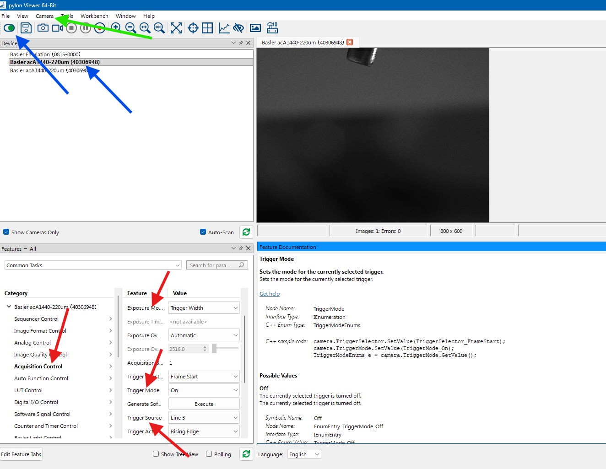

3. 关闭摄像头并退出pylon，编辑camset.py 使得其符合你的配置（摄像头数量和对应pfs文件）

4. 打开iSpy，打开`设置/选项`把优先级设置为**高**，在`设置/存储`添加你的视频储存位置，在`设置/ExtTrig`中选择**Arduino M1**对应的串口号及触发帧率
   
   返回主界面，点击右下角控制菜单中的`cmd_testexttrig`

5. 在主界面选择`添加对象`，添加你的摄像头并设置分辨率
   
   随后设置摄像头名称和两个最大帧率参数，*有触发器的这个数值要略大于触发器帧率*，随后关闭移动检测和提示、在`记录中`选项卡中选择**没有录制**，然后选择录制视频的格式（推荐H264，80％质量即可）和编码器（取决于你的电脑）
   
   其他配置参数可以自行调节
   
   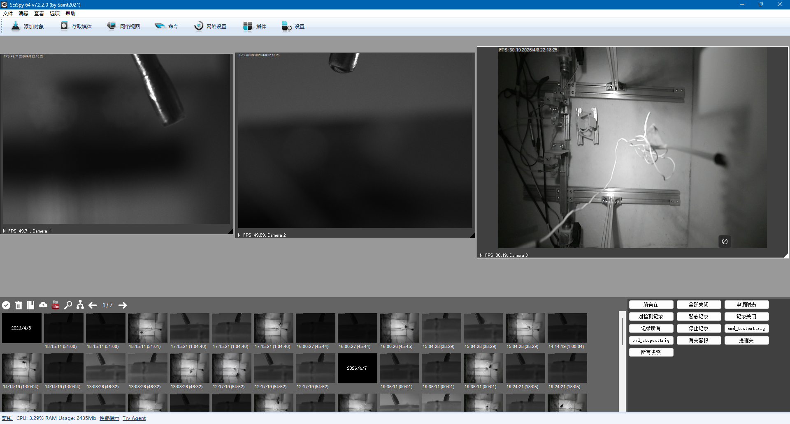

6. 以后**每次开机后先运行camset**，随后运行iSpy，随后便可手动控制录制或者通过logevent（见*硬件记录系统*）触发自动录制
   
   如果运行反了，请关闭先iSpy，否则会报错

---

## 硬件记录系统（LogEvent）

- **LogEvent**，位于📄`programs/logevent_Release/logevnet`，源代码位于📁`/home/zyyk78/HDD/archives/programs/LogEvent/logevent`
  
  硬件记录程序，用于记录Arduion某些Pin口的电平高低，见下

- **Arudino Due程序**，位于📄`programs/Arduino_progs/Due/EventLog_Arm_v4_1`
  
  硬件记录器，需要将其通过`编程口`刷入`Arudino Due`开发板，然后将其连接到`原生口`后将需要记录的信号接入对应的`Port C` Pin口（见*硬件加工指南*）
  
  需要安装📁`programs/Arduino_progs/libraries`中的库

- **ParseEvent**，位于📄`programs/logevent_Release/ParseEvent_matlab`或📄`programs/logevent_Release/ParseEvent_py`，两者功能相同
  
  用于将logevent记录得到的程序转换为可读格式，需要基础的python环境或matlab

- **comcheck**，位于📄`programs/logevent_Release/com_check.py`
  
  用于简单检查当前Aruino Due的连接线是否有虚接情况，需要有python环境且安装了pyserial库
  
  *其原理是：虚接的端口读取时总是上拉为1。因而如果某串口的输入默认是高电平，则这种检查不可用*

### 操作流程

1. 连接好所有组件，安装好所需程序

2. 编辑📄`comcheck.py`使得其中`st_events_bits`与你所连接的PortC号相一致。
   
   运行该文件，检查有无虚接的情况

3. 编辑logevent中的📄`Conf.txt`，格式为：`目录路径，文件名前缀，00，0`，特殊字符为`{date}`和`{time}`。
   
   例如：`D:\records\A07,{date}T7,00,0`的保存路径为`D:\records\A07\20260408_00.evt`
   
   此文件可以根据当天的实验安排实时变更

4. 打开📄`LogEvent.exe`并选择你的串口，然后根据是否有iSpy勾选下方选框（如果没有启动，请关闭端口后将钩子取消，否则会造成程序卡死），随后打开串口（绿色）
   
   SPO2是自动操纵血氧监控软件的，可以不用管
   
   点击`load`加载刚刚填写的配置，然后点击右侧录制按钮即可开始记录串口数据和视频（见*视频录制系统*）（红色）
   
   也可使用定时录制功能
   
   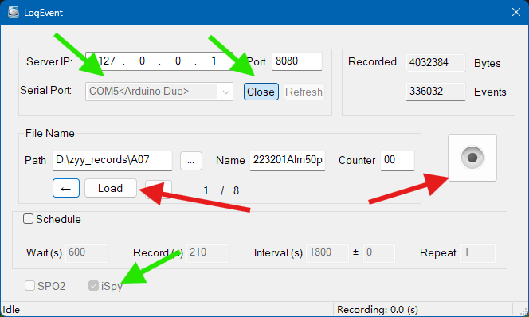

5. 利用`PraseEvent`，将记录得到的evt文件转化为可读的数据结构，并进行进一步处理。
   
   python版中📄`ParseEvent.py`是主函数,📄`Process.ipynb`是一个批处理使用示例
   
   matlab版中📄`ParseEventFile_SJ.m`是程序入口

---

## Miniscope录制程序

- **Miniscope DAQ Software -- Modified**，位于📁`programs/Miniscope_DAQ_Software_Modified/Miniscope-DAQ-QT/build-Miniscope-DAQ-QT-Software-Desktop_Qt_5_14_2_MinGW_64_bit-Release/release`，源代码位于其父文件夹
  
  需要Miniscope系统（见*硬件加工指南*和*设备使用指南*）
  
  Miniscope录制程序，一个可用的最简配置文件位于📄`files/Miniscope/LeastConf.json`，阅读并编辑里面的配置文件到你需要的（大部分参数看名字就能知道用处）

- **Commutator-Adaptor**，位于📁`programs/Miniscope_DAQ_Software_Modified/Commutator_Adapter/build-Commutator_Adapter-Desktop_Qt_5_14_2_MinGW_64_bit-Release/release`，源代码位于其父文件夹
  
  OpenEphys主动式换向器驱动程序，需要搭配DAQ--Modified使用，原版不可使用；如果不使用该主动式换向器则不需要

- **Bonsai-RX**
  
  表现不稳定，因而仅作为备选方案

### 操作流程

1. 连接好所有组件（见*重要工程项目*），安装好所需程序

2. 打开📄`Miniscope-DAQ-QT-Software.exe`，选择或拖入配置文件，然后开始运行
   
   *如果其提示找不到miniscope，请将配置文件中的miniscope1改为其他数字（如miniscope0）并尝试*
   
   其他参数，如初始曝光、最大录制时常、文件路径等，请自行尝试更改

3. 找到左边显示的`Shared BNO Memory`的`Key`值（如**miniscope1_0**，红色)，创建📄`Commutator_Adapter.exe`的快捷方式，将目标修改为形如`Commutator_Adapter.exe miniscope1_0 COM3`的形式（COM3为换向器的串口号）
   
   运行该程序，其应当显示连接到串口和SharedMemory

4. 调整记录参数（蓝色）和显示参数（紫色）
   
   点击`User Config`，将本次录制的参数修改为你所需要的，随后长按`Record`录制或者将`Triggerable`打开（此时会自动关闭激发光和对焦驱动），并通过外部触发线录制，左下角的数字为最大录制时间，到达限制后其会自动关闭录制（绿色）
   
   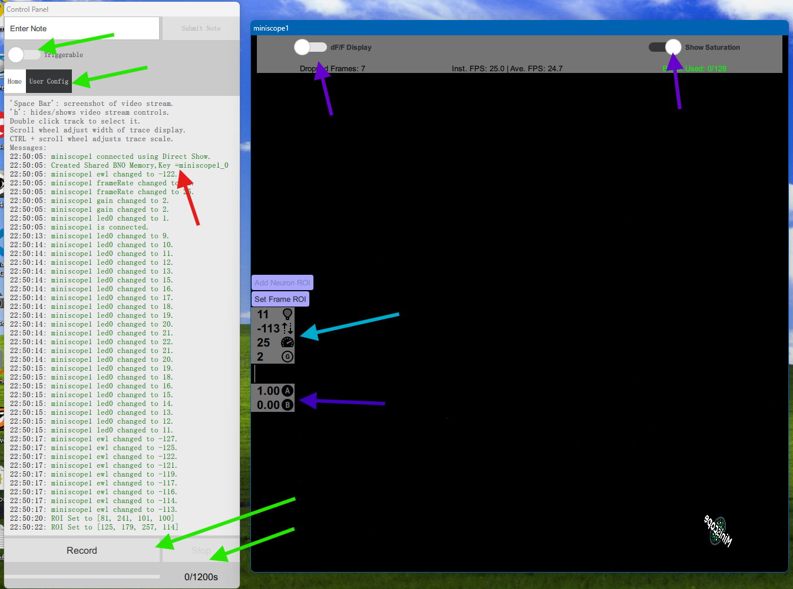

5. 程序会同步记录钙成像视频、陀螺仪数据和元信息

---

## 文件同步系统，本地-云端同步（freefilesync软件）

- **FreeFileSync**，需自行下载
  
  仅**安装在实验电脑中**即可，随后通过sftp远程连接服务器/NAS
  
  随后将数据保存到**存放你的实验数据的地方**（见*服务器使用指南*）

- 使用方法参考：🔗 [如何使用FreeFileSync：一款免费且专业的数据备份与文件同步软件](https://zhuanlan.zhihu.com/p/708192436)

- 关键使用内容：
  
  - 选取：打开软件界面，左侧选择要同步的本地文件夹（源），右侧选择云端（服务器）文件夹
  
  - 比较：点击左侧上方的“比较”，可先比较本地与云端的数据。比较方法包括：文件大小、文件日期等
  
  - 同步：点击右侧上方的“同步”，会弹出窗口。
    
    - 类型：默认选择SFTP
    - 服务器名称或IP地址：192.168.5.5，端口：22
    - 其他默认配置，一般不改动。点击确定即可
  
  - 左侧与右侧之间有一个窄窄的窗口，该窗口有三个符号
    
    - 左箭头：代表云端同步至左侧
    - 灰色横线：代表保持不动。当本地与云端数据的不一致时（比如云端文件本身也发生了改变），选择灰色横线，保持双方各自不动
    - 右箭头：代表本地有、云端无的。同步至云端
  
  - 区分：“双向“与”镜像“与“同步”
    
    - 1.双向同步Two way(双设备协同)
      两边文件夹对等，任意一侧新增/修改/删除文件，都会同步到另一侧;软件会生成数据库记录上次状态，自动判断变更方向。
      
    
    - 2.镜像同步Mirror(标准备份，推荐)
      左侧=源，右侧=备份盘;目标文件夹会和源完全一模一样:源删文件，备份盘同步删除;源新增，备份盘新增。
      适用:电脑文档备份到移动硬盘、NAS。
      风险:右侧独有的文件会被删除，务必确认!
    
    - 3.**更新同步Update***(备份，通常用这种最安全)
      把左侧新文件复制到右侧;不删除云端任何文件。
      

---

## 钙成像分析程序（CaImAn）

- **Analysis Pipeline**，位于📁`git/caiman_scripts.git`
  
  钙成像分析流程，用来从钙成像视频中提取钙信号，需要服务器python环境`caiman`
  
  - 参数列表：以params_example.csv为模板，复制并修改其中参数以使用
  
  - 📄`pre_process.ipynb` ：预处理代码，包括视频分割和参数估算
  
  - 📄`cnmfe_pipeline.py`：主程序，读入参数列表并进行配准或提取
    
    脚本中有一些特殊的配置参数：`NUM_CPU_CORE`表示算法最高线程数，`NUM_CNMF_BATCH`表示CNMF的并行数，增加该参数会成倍增加内存占用量！
  
  - 📄`view_result.ipynb`：查看结果、手动筛选结果
  
  - 📄`multisession_registration.ipynb`：多天分析结果配准
  
  - 📄`predict_result.ipynb`：自动筛选结果（测试中）
  
  - 📁`auto_screener/*`：训练自动筛选器（测试中）
  
  - 其他引用文件

### 处理流程图

以下处理流程描述适用于处理**一只**小鼠在多个session中的成像

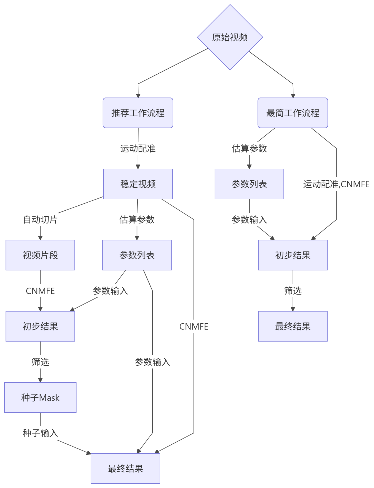

### 过程文件流入流出图

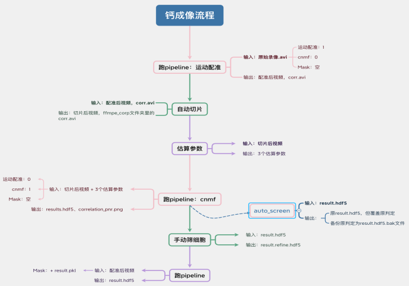

### 推荐工作流程

优点是稳定可靠，不容易爆内存，可重复性高；缺点是步骤繁琐

1. 打开📄`pre_process.ipynb`，运行前两个格子，查找并打印需处理的原始视频路径
   
   💡运行第二个格子时需要输入你存放成像视频的文件路径，例如你的视频存放在`.../E01/data1/0.avi`，`.../E01/data2/0.avi`之类的地方，那么只需要输入`.../E01`即可；换言之你输入的文件夹下要包含你想要处理的所有视频
   
   💡**其中，第二个格子存储了筛选和排序输出文件路径的条件，例如，你希望查找老鼠在实验组`data0` 中录制的视频，那么就可以设置`'in_name': 'data0'`，`'name_end': '.avi'`；如果你希望排除实验组`data5`的数据 ，那么可以设置`not_in_name' : 'data5'`，详细用法见函数`find_target_file`的说明**
   
   具体文件夹结构需要你查看你自行查看

2. 将视频路径粘贴到`参数列表`中的`fnames`行，如一个session中有多个视频则可自动拼接，随后填写fr和最顶部行的信息
   
   💡你可以复制程序的所有输入，然后将其粘贴到Excel中，再次选中格子并复制，然后**转置粘贴**即可
   
   将`do_motion_corr`行设置为1，`do_cnmf`行设置为0，其他配准参数自行阅读说明并调整
   
   💡注意，`params_example.csv`就是`参数列表`的模板，你可以将其复制一份使用，并且依据本教程或你的需求去**动态调整里面的内容！** 
   
   💡程序在读取该文件的会按列读取文件，所以每有一个视频文件需要处理，则就应当有一列完整的参数！
   
   💡具体使用说明请阅读文件的前几行！
   
   💡如果有你的老鼠在一次实验中录制了多段视频（即所谓‘一个session中有多个视频），则你可以使用类似`path/data/0.avi?path/data/1.avi?path/data/2.avi`这样的格式进行三视频合并输入；这些输入视频将被自动拼接成一个长视频！

3. 运行📄`cnmfe_pipeline.py`并输入`参数列表`（即，你自己复制并编辑过的那个）所在的路径，程序就会依照列表配准视频（**也就是消除相机晃动**），新视频会保存到原位并重命名（添加_corr的后缀）
   
   💡如果在这一步，某个文件的输入出现了‘?‘符号分割的多个视频，那么程序将会在第一个视频的文件夹下生成一个拼接并配准后的视频，例如前面举例的三视频合并将会输出`.../E01/data1/0_{时间戳}_corr.avi`，其包三个视频依次拼接的所有帧

4. 回到📄`pre_process.ipynb`，重新查找并打印配准后的视频列表（你可以设置`'name_end': 'corr.avi'`以实现此功能），此时再运行第三个格子（包含`ffmpeg_crop`函数，即`自动切片`），程序则会在你第一步输入的目录下生成一个后缀为`{时间戳}_ffmpeg_crop`的文件夹，里面包含一系列切片视频（即，从原视频中抽取一系列短片段并拼接在一起的新视频）
   
   随后运行下方`估算参数`的一系列格子，在第一个格子中会弹出窗口让你选择视频，随便选择一个切片视频，并估算关键参数`gsig`、`min_pnr`和`min_corr`，其具体含义和估算方法请阅读文件中的说明

5. 重新查找并打印切片后的视频路径，将其粘贴到`参数列表`中的`fnames`行，随后填写fr和最顶部行的信息
   
   将`do_motion_corr`行设置为0，`do_cnmf`行设置为1，**将前面估算得到的三个关键参数填入对应行**，其他初始化和识别参数可以自行调整
   
   将参数复制并填满文件对应的列

6. 运行📄`cnmfe_pipeline.py`并输入参数列表所在的路径，程序会进行识别并在原位将结果保存为hdf5文件，例如输入`.../E01/{时间戳}_ffmpeg_crop/data1/0_{时间戳}_corr.avi`将会在原位得到一个`0_{时间戳}_corr_{时间戳}_results.hdf5`文件
   
   1. 打开📄`view_result.ipynb`，并运行前两个格子，按代码要求输入待筛文件夹路径。例如`.../E01/{时间戳}_ffmpeg_crop/`）。注意，是选择**裁剪后的视频**（命名带有ffmpeg_crop文件）进行筛细胞。
      
      随后依次运行下方格子执行手动筛选：
      
      - 第三格：加载并预览结果
      
      - 第四格：圈出有细胞分布区域的ROI（见*下方的“工作流程插图“第一张*）
      
      - 第五格：在弹出的窗口中手动筛选细胞（亮斑）：`A/D`键上/下切换细胞，`空格`键切换其是否丢弃（红色为选中，蓝色为丢弃），`E`键开关mask准星显示，`F`键切换背景，`B`键分割mask
      
      - 添加mask的格子按需运行（如果你发现明显有的细胞很亮但是似乎没有被圈出来）
      
      - 一直运行，直到最后一格，从而将应用筛选结果并保存为pkl文件（例如`0_{时间戳}_corr_{时间戳}_results.pkl`?
      
      ~~也可尝试使用📄`predict_result.ipynb`自动筛选细胞~~

7. 回到📄`pre_process.ipynb`，重新查找并打印**配准后的视频列表（corr.avi后缀的、未经裁剪的文件）**和**pkl文件列表**，将两者匹配（使用excel即可完成），并分别粘贴到`参数列表csv文件`中的`fnames`行和`mask_path`行，其他参数同**第五步**，例如`.../E01/data1/0_{时间戳}corr.avi`应当对应`.../E01/{时间戳}_ffmpeg_crop/data1/0_{时间戳}_corr_{时间戳}_results.pkl`（路径实在是有点长，不过真的没办法）

8. 运行📄`cnmfe_pipeline.py`并输入参数列表所在的路径，程序会进行识别并在原位将结果保存为hdf5文件，例如`.../E01/data1/0_{时间戳}corr_{时间戳}_results.hdf`

9. 该hdf5文件可直接使用`h5py`库读取，不一定需要`caiman`环境

10. 如果需要跨天配准，请运行📄`multisession_registration.ipynb`并遵循文件内的指导操作

### 最简工作流程

优点是操作简单；缺点是识别得到的伪影多，灵活性差，运行时长和内存占用不稳定

如果因为内存耗尽而崩溃，请在📄`cnmfe_pipeline.py`文件中减小`NUM_CNMF_BATCH`的数值

1. 打开📄`pre_process.ipynb`，运行前两个格子，查找并打印需处理的原始视频的路径列表
   
   不要运行`剪裁合并`的格子
   
   随后运行下方`估算参数`的一系列格子（选择配准），并估算关键参数gsig、min_pnr和min_corr，具体含义请阅读文件中的说明

2. 视频路径粘贴到`参数列表`中的`fnames`行，如一个session中有多个视频则可自动拼接（见csv中的描述），将`do_motion_corr`行和`do_cnmf`行设置为1，将前面估算得到的三个关键参数填入对应行，其他参数自行调整

3. 运行📄`cnmfe_pipeline.py`并输入参数列表所在的路径，程序会进行配准并再原位保存视频，随后进行识别并将结果保存为hdf5文件

4. 如果对识别结果不满意，可以将已配准的视频作为输入，并将`do_motion_corr`行设置为0，调整其他参数后重新运行

5. 打开📄`view_result.ipynb`，并运行前两个格子，选择结果文件所在的目录，随后依次运行下方格子见*工作流程插图*）：
   
   - 加载并预览结果
   - 圈出有细胞分布区域的ROI
   - 手动筛选细胞：红色为选中，蓝色为丢弃，`A/D`键切换上细胞，`空格`键切换其是否丢弃，`E`键开关mask显示，`F`键切换背景，`B`键无效！
   - 将筛选应用到结果并保存为hdf5文件（会自动添加_refine的后缀），不需要保存pkl
   
   运行直到所有文件都处理完成

6. 经过筛选的hdf5文件可直接使用`h5py`库读取，不一定需要`caiman`环境

7. 如果需要跨天配准，请运行📄`multisession_registration.ipynb`并遵循文件内的指导操作

### 工作流程插图

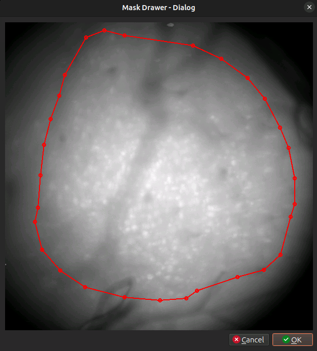

以上为绘制ROI的界面：用鼠标点击并绘制红圈，红圈外的Mask（一般为伪影）将会被丢弃且不会进入筛选界面；如果不需要绘制则直接点击OK即可

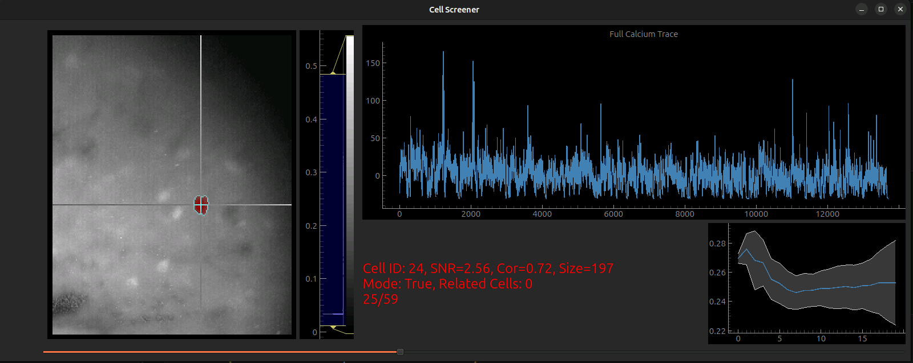

以上为筛选器界面，左侧为Mask示意图，十字准星指向mask重心，同时还会显示与此mask有关的其他mask（图中未展示），颜色与当前mask又一定差异），图片可以缩放和拖动，右侧滑条可以改变显示亮度范围；右侧为信息显示界面，上方为提取得到的钙信号，左下下为基本信息，右下为径向平均亮度（细胞应当呈现向下趋势或如图）

自带红蓝标签，是程序根据波形等图像信息的初步预测

F切换可以看到：原图、信噪比、空间相关性。筛选一般看原图

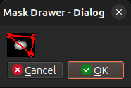

以上为细胞分割界面，在红色框内的部分会被分配到一个新cell，剩余部分被分配到另一个；此功能仅用于分割黏着在一起的seed mask

### 自动筛选器训练流程（测试中）

需要：经过手动筛选的hdf5文件（后缀为_refine.hdf5)，内部必须同时包含正负样本，文件数量最好不少于50个

如果训练效果不好，则需要自行进行调整

1. 打开📄`auto_screener/train_cnn_screener.ipynb`，修改第一个格子中的输出路径，并执行前两个格子以筛选出训练用的文件

2. 执行第三个格子，将原始文件转换为tensorflow专用文件

3. 依次执行后续格子：
   
   - 定义神经网络
   - 准备数据集
   - 训练
   - 查看训练情况
   - 保存模型文件

4. 打开📄`auto_screener/train_RF_total.ipynb`，修改第一个格子中的输出路径和CNN模型路径，并执行前两个格子以筛选出训练用的文件

5. 依次执行后续格子

---

## Yolo训练程序

- 请先熟悉Yolo相关基础知识：🔗 [Ultralytics YOLO 文档](https://docs.ultralytics.com/zh/)

- **YoloV11 Mouse Pose Estimation Project**，位于 🔗 [https://github.com/hehedafly/YoloV11.git](https://github.com/hehedafly/YoloV11.git)
  
  从小鼠行为视频中提取小鼠的位置和姿态等信息，需要服务器python环境`yolo11`
  
  - 📄`MovingExtract.py`：利用背景减除法从视频中提取小鼠追踪框
  - 📄`YoloTrainDataSplit.py`：划分训练集和验证集
  - 📄`YoloTrain.py`/📄`yoloTrain.yaml`/📄`yoloPoseTrain.yaml`：Yolo训练脚本与配置文件
  - 预训练模型和输入输出文件夹
  - 其他文件和功能，包括unity接口

### 训练流程图

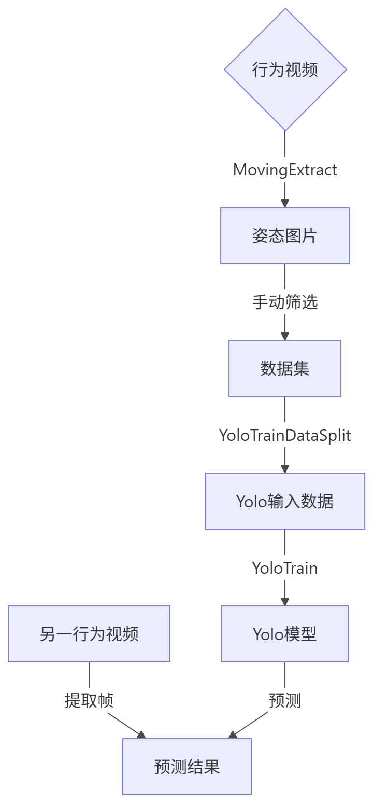

### 训练流程

1. 打开📄`MovingExtract.py`，修改开头的配置：`mediaName` = 要用来训练的视频，`useModel` = False，`PoseExtract` = 是否提取姿态，`PoseExtractDivider` = 提取间隔帧数，`show` = 提取过程是否需要可视化，其他配置参数见📄`README.md`
   
   如果你有已训练的模型而希望进行改进，更改`useModel` = True，并修改下方`model = YOLO("path/to/your_model")`

2. 运行，弹出ROI选择窗口，左键拖动可以框选区域，按`Enter`键删除这片区域，剩下的部分就是ROI，删到基本符合要求后按`S`键进行下一步。

3. 如果`PoseExtract` = False，请在程序运行结束后，进入文件夹`PoseExtract{时间戳}`，挑拣png文件，删掉所有**不是**小鼠或者包含伪影的那些png
   
   如果`PoseExtract` = True，则遵循以下流程：
   
   - 弹窗显示检测到的 ROI，放大 4 倍便于标注
   - **左键**：标注可见关键点
   - **右键**：标注不可见关键点
   - **Backspace**：删除上一个点
   - **Enter**：确认当前标注，保存并退出
   - **N**：跳过当前帧
   - **Shift+ESC**：强制退出

4. 打开📄`YoloTrainDataSplit.py`修改`MainDatasetPaths = [r'path/to/your_PoseExtract_folder']`，运行后输出Yolo标准训练文件
   
   随后根据你的需要

5. 打开📄`YoloTrain.py`，根据你的需要编辑两个Yaml文件中的一个，并修改`model.train(data="path/to/your_yaml",...`指向你的Yaml，随后运行文件

6. 最终模型位于📄`runs/detect/train{N}/weights/best.pt`

7. 使用模型的方法随你的具体任务而定，在此处不提供统一代码

### 自动筛选器使用流程

### 程序原理图

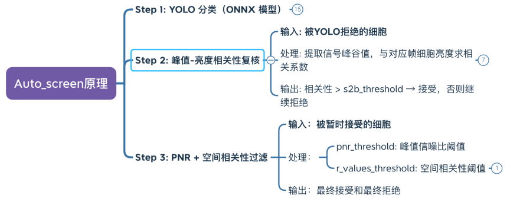

---

## 推送提醒

### PushPlus

- 网站：https://www.pushplus.plus/

- 注册一个账号，然后绑定微信公众号（好像需要几块钱的验证费用），随后你会获得一个token

- 按照这个模板`https://www.pushplus.plus/send?token=XXXXX&title=XXX&content=XXX` 把你的token、标题和内容填进去，访问网页即可发送

- 在你的程序内可以通过某些库来访问http达到自动提醒的功能

- 注意不要反复推送相同的内容，会被屏蔽！消息请务必加上时间戳

- 注册一个账号，然后绑定微信公众号（好像需要几块钱的验证费用），随后你会获得一个token

- 按照这个模板`https://www.pushplus.plus/send?token=XXXXX&title=XXX&content=XXX` 把你的token、标题和内容填进去，访问网页即可发送

- 在你的程序内可以通过某些库来访问http达到自动提醒的功能

- 注意不要反复推送相同的内容，会被屏蔽！消息请务必加上时间戳

---

### 

---

---