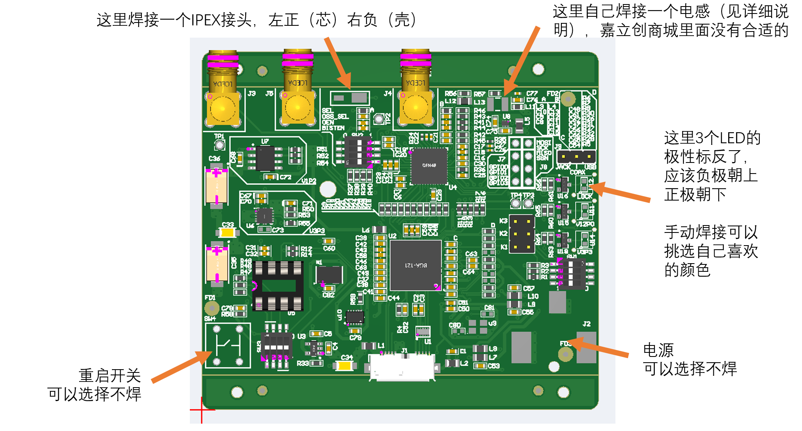
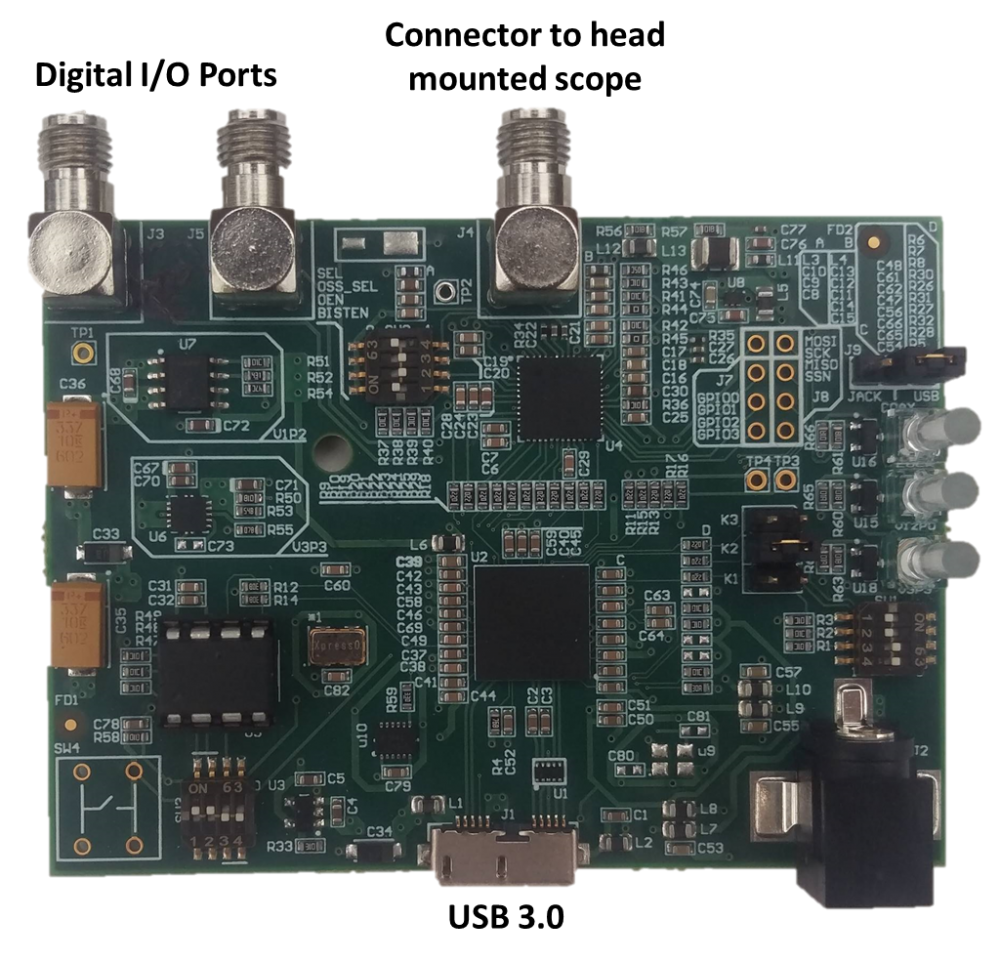
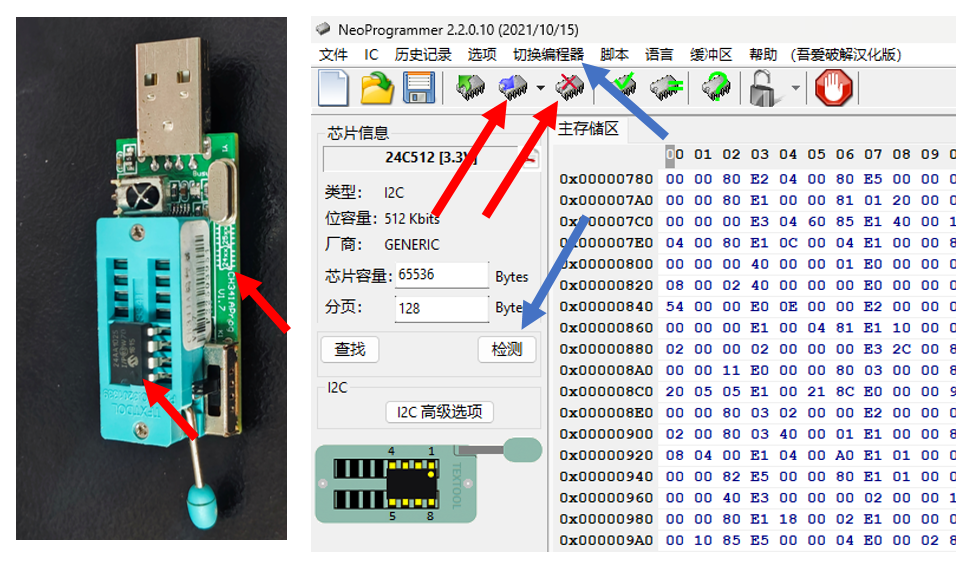
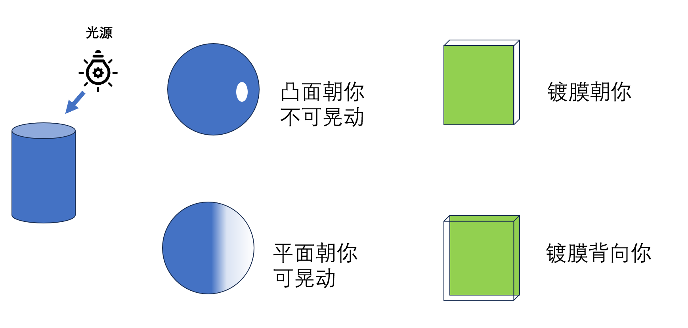

# 重要工程项目

不要忘记这些设备是如何加工出来的

#### MiniScope DAQ PCB

[Miniscope_DAQ_PCB/v3_2 at master · daharoni/Miniscope_DAQ_PCB](https://github.com/daharoni/Miniscope_DAQ_PCB/tree/master)

[daharoni/Miniscope_DAQ_Box](https://github.com/daharoni/Miniscope_DAQ_Box/tree/master)

参考价格：500/PCS

- PCB加工
  
  PCB加工文件（`Gerber`文件）位于`files/Miniscope/DAQ/Fabrication Files/USB_Control.zip`，可以直接用于定制；设计文件位于`files/Miniscope/DAQ/Design Files.zip`，可以上传嘉立创EDA（选择Altium Designer格式）检查和编辑
  
  板子为四层板，详细信息位于`files/Miniscope/DAQ/Fabrication Files/Miniscope_DAQ_PCB_Fab_Info.docx`和`USB_Control_BoardStack.xls`

- SMT贴片
  
  这部分坑还是比较多，我们匹配好的嘉立创可用的贴片BOM表位于`files/Miniscope/DAQ/Fabrication Files/BOM_PASTER_8275695A_Y1.xls`，坐标位于`Pick Place for USB_Control.csv` 这两个文件可以直接用于匹配，原始BOM文件位于`files/Miniscope/DAQ/Assembly Files`以供参考
  
  有的元件需要订货，会比较慢
  
  图中提到的电感是L13，规格：`1210`封装，参数：`100UH 340mA 1.82Ω`，存放在*Miniscope DAQ 配件*格子中
  
  PCB上的LED引脚标错了，可以自行编辑并保存工程文件，焊接的时候挑一个自己喜欢的0603LED焊上去就行，存放在对应格子中

- 如图连接所示**调整3个开关和2个跳线帽**，跳线帽存放在对应格子中

- 准备一块**24AA025 I/P**芯片（或者同类替代芯片）安装到CH341编程器上（存放在对应格子中），注意芯片朝向（图中一个红色箭头指向小圆点标志，另一个指向说明图），电压挡位调整到3.3V打开NeoProgrammer（公共电脑上有），点击`切换编程器`，选择CH341编程器（随便哪个都可以），然后点击`检测`后选择芯片（蓝色箭头)。
  
  点击`文件/打开`，加载HEX文件（位于`files/Miniscope/DAQ/Miniscope_DAQ_128K_EEPROM_3.3V.bin`），然后先点击`擦除芯片`，等待操作后点击`写入芯片`（红色芯片），操作完成后拔下编程器取下芯片
  
  将芯片装入MiniscopeDAQ板，**注意方向！圆点朝向DAQ示意图中左下**

- 如果你希望按照官方的方式刷写芯片，则可以直接将芯片插入DAQ板（注意方向！），随后遵循[Aharoni-Lab/Miniscope-DAQ-Cypress-firmware](https://github.com/Aharoni-Lab/Miniscope-DAQ-Cypress-firmware)中的指示（所需软件在公共电脑上有）

- 3D打印一个外壳，文件位于`models/Miniscope/DAQ/DAQ Box FPD_Linkv3.2.STL`，里面有两个组件，需要右键`拆分/到零件`（拓竹）

#### Miniscope Rigid-Flex PCB

[Aharoni-Lab/Miniscope-v4: All things Miniscope v4](https://github.com/Aharoni-Lab/Miniscope-v4)

参考价格：2000/PCS

- PCB加工和STM
  
  加工文件在`files/Miniscope/MS_441/Gerbers_4_41.zip`，丢给合作厂商即可，加工工艺要求：[Rigid Flex PCB · Aharoni-Lab/Miniscope-v4 Wiki](https://github.com/Aharoni-Lab/Miniscope-v4/wiki/Rigid-Flex-PCB)，注意**要说明板子要黑色的**，此外PCB板层厚度文件在`files/Miniscope/MS_441/MS_441_Layers.xlsx`，这个文件在原始文件中似乎没有
  
  BOM表和坐标文件在`files/Miniscope/MS_441/PnP_v_4_41`中
  
  工程文件在`files/Miniscope/MS_441/ms_441_kicad.zip`，可以导入到嘉立创EDA查看，导入的时候选KiCAD即可

- MCU编程
  
  [MCU Programming · Aharoni-Lab/Miniscope-v4 Wiki](https://github.com/Aharoni-Lab/Miniscope-v4/wiki/MCU-Programming)
  
  [Atmel AVRISP MkII](https://ww1.microchip.com/downloads/en/DeviceDoc/Atmel-42093-AVR-ISP-mkII_UserGuide.pdf)，找6针ISP接口即可
  
  所需软件公共电脑上都有
  
  老大难的步骤，嵌入式碰到各种莫名其妙的问题很常见
  
  1. 连接PCB供电线，**用自制的5V供电头（和编程器放在一起，外壳接地内芯5V），不要用DAQ板供电！**
  
  2. 连接好**AVRISP MKII**编程器，注意图中蓝色箭头处要白色标记对白色标记连接（先都是对好的，然后把供电线和编程器插到电脑上
  
  3. 把编程头夹到PCB上的六个金触点处！位置如图所示，夹子上有一个限位螺栓，把它调到**刚好能夹住PCB，但是又不会压翘起来**的程度
     
     后面可能需要反复调整位置，看起来六个头都接触到了触点即可！一般来说此时编程器会亮起两个绿灯（没夹好就是一红一绿）
  
  4. 打开Microchip Studio，点击`Tools/Device Programming`
  
  5. 在弹出的界面选择好编程器，然后芯片选`ATmega328`，`点击Apply`（红色箭头）
  
  6. 点击Target Voltage下面的`Read`，如果读到的电压大于=>1.8V则点击旁边Device Signatures下的`Read`（红色箭头）
     
     如果读到的电压是0，则需要重新调整夹子的位置（一般来说不用断电，直接重新调整就行）
     
     如果读到的电压总是＞0却<1.8，似乎而且说明这个PCB的体质似乎不是很好（处理方法暂不确定，可能同时需要为编程头提供1.8V的电压，见wiki）
     
     如果电压足够但签名的时候报错，说明编程头可能有哪里短路了，需要重新调整夹子的位置，如果反复调整还是不行，那可能是PCB出问题了
  
  7. 如果读到了签名，则切换到Memories页面，选择Flash文件（位于`files/Miniscope/MS_441/Miniscope-v4-MCU.hex`，勾选左边写入前擦除和写入后验证后点击`Program`
     
     等进度条跑完，Miniscope板上的LED应该就会亮起了，此时取下编程器并拔掉电源即可
     
     

#### Miniscope其他部件

[Part Procurement · Aharoni-Lab/Miniscope-v4 Wiki](https://github.com/Aharoni-Lab/Miniscope-v4/wiki/Part-Procurement#individual-components-miniscope-body-parts)

- 机身：`models/Miniscope/MiniscopeV4/PlasticParts`，推荐使用Delrin（一种POM，即聚甲醛）进行CNC切削；也可进行3D打印，但强度和遮光性稍差

- 底座和接口：`models/Miniscope/MiniscopeV4/MetalParts`，使用铝合金CNC加工即可，有的Miniscope接口尺寸会比5mm稍大一点，就要使用L尺寸的接口，反之使用M尺寸即可
  
  也可以统一加工M尺寸，然后根据需要用进行手工打磨

- 光学元件：照表买就行，其中半球透镜可以替换成同尺寸淘宝K9光学玻璃的，性能没区别，三种镀膜滤光片以淘宝采购和切割
  
  其中EWL透镜有概率损坏，因此有一些备用件

- 连接线：直径1mm左右的同轴缆线（见wiki）

- 螺丝：M1*3，淘宝上可以买到十字花的，没区别

#### Miniscope组装

[Assembly · Aharoni-Lab/Miniscope-v4 Wiki --- Assembly · Aharoni-Lab/Miniscope-v4 Wiki](https://github.com/Aharoni-Lab/Miniscope-v4/wiki/Assembly)，请仔细阅读其中的组装说明

参考视频在`files/Miniscope/MS_441/Miniscope assembly & data acquisition software.mp4`，安装顺序可能和教程略有区别，推荐组装流程：

1. 整理和检查零件

2. 将透镜等安装到位，然后将激发模块和成像模块组装到一起

3. 预折叠电路板的EWL供电线圈（不要太用力！会折断内部线路！）

4. 将组装好的成像模块扣到传感器上，使用光固化胶简单固定，然后把激发电路板安装上去

5. 将螺丝拧到物镜模块上并拧到底，将物镜模块扣到丞相模块上（并把电路板也勾上去），大致拧2-4圈螺丝，然后把线圈和EWL透镜塞进去；用镊子调整线圈差不多卡在塑料件里面，不要伸出来太多，随后大致拧紧

6. 检查连接情况情况：红绿箭头指向两个金属触点，黄色箭头指向EWL外壳，**红色和绿色之间应当是绝缘的，红色和黄色之间应当是导通的！**，如果出现短路等情况则应当重新松开螺栓调整线圈和EWL的位置，反之稍微拧紧即可（不必太紧）
   
   如果反复测试红黄之间仍不能导通，则需进行进一步检修（见*设备使用指南*）
   
   

7. 通电开机（见*设备使用指南*和*软件使用指南*），检查LED是否正常；随后用一张镜头纸裹住镜头并调节到刚好能看清纤维，拉动对焦条检查对焦是否正常
   
   如果出现无法调焦的情况，请重新调整线圈和EWL的位置；如果一直无法调焦，则需进行进一步检修（见*设备使用指南*）

**教程中没写的注意事项**：

- 组装过程最好带上手套，防止皮肤油脂沾到光学组件上

- 组装开始前，请使用棉签和无水乙醇/异丙醇清洗所使用的镊子；检查塑料件内部有无多余塑料屑，如果有的话用镊子扯掉

- 如果滤光片或传感器脏了，可以尝试使用PE静电膜清理
  
  如果清理不掉，可使用镊子夹擦镜纸团取沾有无水乙醇乙醇/异丙醇，使用另一个镊子夹住透镜边缘（轻一点，别夹碎了）把他竖在几层擦镜纸上，用棉签或纸团从上到下刷洗后用洗耳球吹干。如果刷干净了，那么该层的反光将会呈现一致且均匀的颜色
  
  注意不要让纸屑和棉纤维残留在镜片和传感器边缘，如果有的话请务必用精细镊清理干净

- 物镜有两个Lens，不要漏装！安装镜片的时候注意不要装反！可以将透镜放到一张擦镜纸上，用灯光照一下，或用镊子戳一下
  
  

- 胶粘时，可以先用诺兰光固化胶（目前81号的性能较好）在底座附近涂抹一圈并固定；组装全部完成后再涂抹一圈3M的AB树脂，第二天便可固化完成

---

## 主动式换向器

没有制作过

---

## 半主动式换向器

TODO

---

## 手术设备

#### 环形HeadBar

单个模型位于`models/Ring_headbar.stl`，已添加支撑并可直接可打印的模型位于`models/Ring_headbar.chitubox`

#### GRIN LENS植入装置

模型资料文件位于`models/Miniscope/GRIN_Lens_Implant`，需要购买三个位移台和夹子（文件夹中有对应型号的图纸），底座需要使用不锈钢进行CNC加工，miniscope夹具位于`models/Miniscope/holder/Holder - Straight加夹持柱withLENS.stl`

此外还需要2 * Φ8光轴和一系列螺丝，以及光轴夹具（模型丢失了，需要用的时候重新测绘建模即可）

其中GRIN LENS需要使用特殊方法固定：

1. 定制一系列*尺寸暂不确定,TODO*的金属环，随后焊接一根弯折90°的**方形排针**；将焊接好的金属环套到LENS上，并使其上边缘与LENS上表面大致齐平，随后使用诺兰光固化胶固定住其下缘，不要让LENS上表面沾上胶

组合体如图所示

#### 非可视式GRIN LENS植入装置

GRIN LENS有许多不同尺寸的，其中适用于1.0mm的LENS的模型位于`models/LENS/lens夹持.stl`；其他尺寸需要修改对应ipt文件

#### Baseplate安装器

模型位于`models/Miniscope/holder/Holder - Straight加夹持柱.stl`

#### 微操面罩

模型位于`models/微操面罩/mask_thread.ipt`
