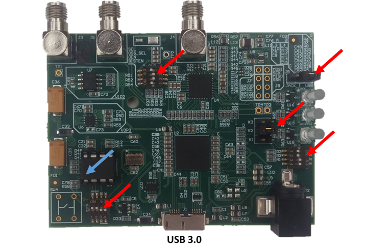
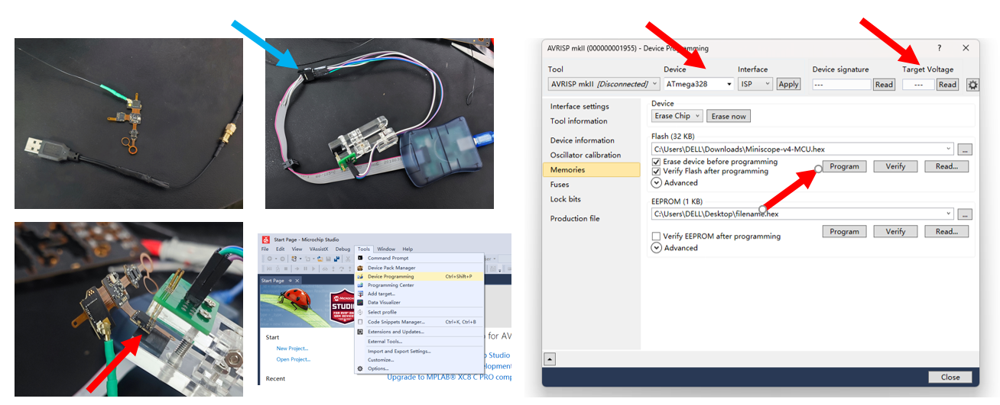
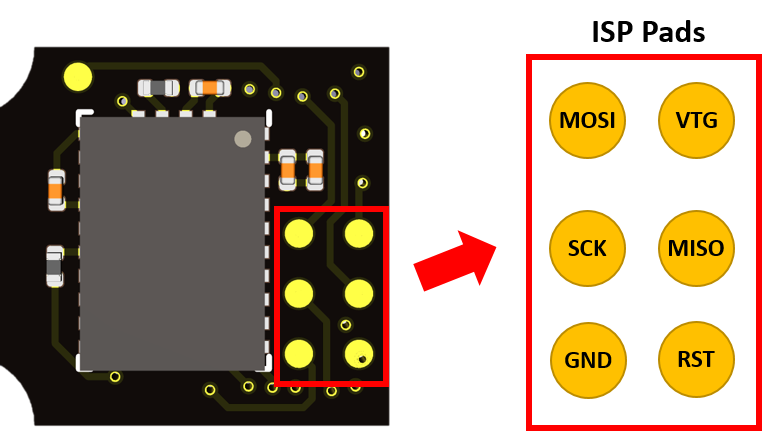
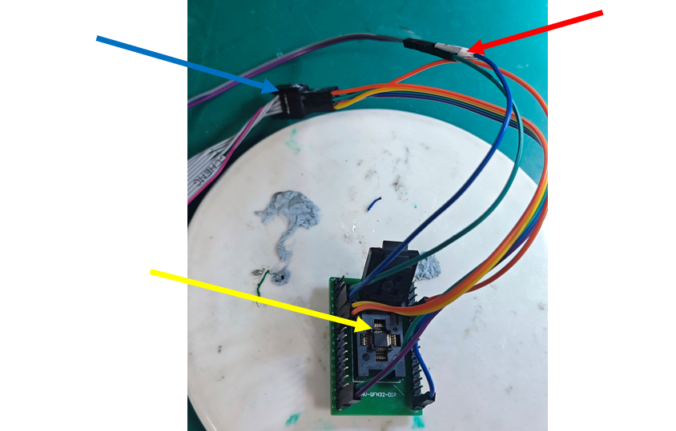
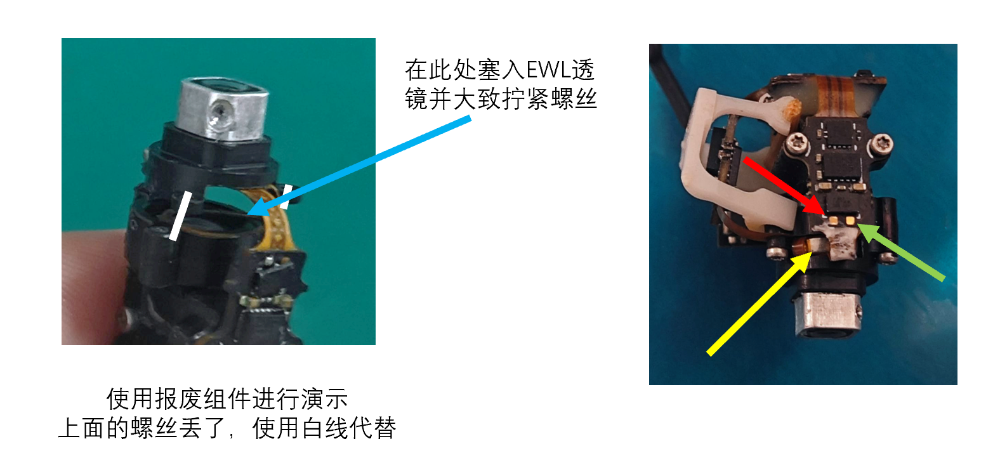
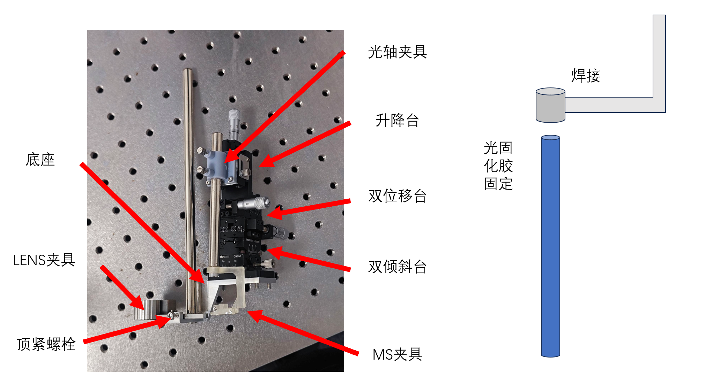

# 重要工程项目

本文中提到的部分路径是基于📁`/mnt/HDD1/archives`的相对路径，如📁`files/example`或📄`models/example.stl`

不要忘记这些设备是如何加工出来的

---

## Miniscope

### Miniscope DAQ PCB

🔗 [Miniscope_DAQ_PCB/v3_2 at master · daharoni/Miniscope_DAQ_PCB](https://github.com/daharoni/Miniscope_DAQ_PCB/tree/master)

🔗 [daharoni/Miniscope_DAQ_Box](https://github.com/daharoni/Miniscope_DAQ_Box/tree/master)

参考价格：500/PCS

- **PCB 加工**
  
  PCB 加工文件（`Gerber`文件）位于📄`files/Miniscope/DAQ/Fabrication Files/USB_Control.zip`，可以直接用于定制；设计文件位于📄`files/Miniscope/DAQ/Design Files.zip`，可以上传嘉立创 EDA（选择 Altium Designer 格式）检查和编辑
  
  板子为四层板，详细信息位于📄`files/Miniscope/DAQ/Fabrication Files/Miniscope_DAQ_PCB_Fab_Info.docx`和📄`USB_Control_BoardStack.xls`

- **SMT 贴片**
  
  这部分坑还是比较多，我们匹配好的嘉立创可用的贴片 BOM 表位于📄`files/Miniscope/DAQ/Fabrication Files/BOM_PASTER_8275695A_Y1.xls`，坐标位于📄`Pick Place for USB_Control.csv` 这两个文件可以直接用于匹配，原始 BOM 文件位于📁`files/Miniscope/DAQ/Assembly Files`以供参考
  
  有的元件需要订货，会比较慢
  
  
  
  图中提到的电感是 L13，规格：`1210`封装，参数：`100UH 340mA 1.82Ω`，存放在 Miniscope DAQ 配件格子中
  
  PCB 上的 LED 引脚标错了，可以自行编辑并保存工程文件，焊接的时候挑一个自己喜欢的 0603LED 焊上去就行，存放在对应格子中

- 如图中红色箭头连接所示，**调整 3 个开关和 2 个跳线帽**，跳线帽存放在对应格子中
  
  

- 准备一块**24AA025 I/P**芯片（或者同类替代芯片）插入 DAQ 板（注意方向！！圆点朝向 DAQ 示意图中左下，即上图中蓝色箭头所指的位置），随后遵循🔗 [Aharoni-Lab/Miniscope-DAQ-Cypress-firmware](https://github.com/Aharoni-Lab/Miniscope-DAQ-Cypress-firmware)中的指示操作（所需软件在公共电脑上有）
  
  简单来讲，流程如下
  
  1. 将在 K1位置插入一个跳线帽
  
  2. 板子使用 USB 3.0 连接线插到电脑上，打开`USB Control`这个软件（英飞凌的，公共电脑上有），随后选中列表中弹出的那一项
  
  3. 点击`Program`--`FX3`--`I2C EEROM`，稍等一下后选择 ISO 文件（位于📄`files/Miniscope/DAQ/Miniscope_DAQ_128K_EEPROM.img`），等待刷写完成（此时软件左下角会提示 Succeeded）
     
     ⚠️ 注意！如果此时报错说需要重置设备，请点击右上角的黄色小闪电（Reset Device），等左下角提示Succeed，拔掉线等待20秒左右重新插上即可
  
  4. 拔掉 K1位跳线帽，即可正常使用

- 3D 打印一个外壳，文件位于📄`models/Miniscope/DAQ/DAQ Box FPD_Linkv3.2.STL`，里面有两个组件，需要右键`拆分/到零件`（拓竹）

- 连接好 Miniscope，使用**USB 3.0**连接线接入电脑

### Miniscope Rigid-Flex PCB

🔗 [Aharoni-Lab/Miniscope-v4: All things Miniscope v4](https://github.com/Aharoni-Lab/Miniscope-v4)

参考价格：2000/PCS

- **PCB 加工和 STM**
  
  加工文件在📄`files/Miniscope/MS_441/Gerbers_4_41.zip`，丢给合作厂商即可，加工工艺要求：🔗 [Rigid Flex PCB · Aharoni-Lab/Miniscope-v4 Wiki](https://github.com/Aharoni-Lab/Miniscope-v4/wiki/Rigid-Flex-PCB)，注意**要说明板子要黑色的**，此外 PCB 板层厚度文件在📄`files/Miniscope/MS_441/MS_441_Layers.xlsx`，这个是加工厂切片测量得到的
  
  BOM 表和坐标文件在📁`files/Miniscope/MS_441/PnP_v_4_41`中，其中的📄`ibom_4_41.html`文件可以很方便的用于查看；可以自行购买或替换部分原件并邮寄，这样成本会低很多。推荐列表如下
  
  | 位号  | 名称                   | 可选替代（原始BOM表未修改）                                                                            |
  | --- | -------------------- | ------------------------------------------------------------------------------------------ |
  | D1  | LXZ1-PB01            | 可选其他波长的系统，注意需要同步替换滤光片！见下文                                                                  |
  | L5  | ADL3225V-470MT-TL000 |                                                                                            |
  | U1  | ATmega328-MU         | 可选168V/328P，在刷程序的界面选择对应型号即可（168V选168/A即可）但是别买成168/A（电压不匹配），并注意买QFN32封装（MU/MUR后缀）的！         |
  | U12 | BNO055               |                                                                                            |
  | U9  | DS90UB913ATRTVTQ1    |                                                                                            |
  | U2  | LTC3218              | 不同后缀的没区别                                                                                   |
  | U4  | MAX14574EWL          | 可选后缀带 "+" 和 “T” ，没区别                                                                       |
  | U6  | NOIP1SP0480A         |                                                                                            |
  | U11 | PCA9509AGM           | 已停产，可用PCA9509PGM替换，需要额外在R13和R14的位置补上一个0201的4.7KΩ上拉电阻（原本是个空焊盘）                              |
  | U7  | SG-210STF 66.6667ML3 | 可选其他后缀（如SG210-SBC），或NZ2520SH等其他类似的-4脚2520-66.6667/66.667MHZ-3V3-CMOS晶振；也有可编程版本，但可能需要修改固件代码 |
  | U3  | TPL0102-100RUCR      |                                                                                            |
  
  工程文件在📄`files/Miniscope/MS_441/ms_441_kicad.zip`，可以导入到嘉立创 EDA 查看，导入的时候选 KiCAD 即可
  
  其中 MCU（ATmega328）可以和其他原件一同购买和贴片（见*MCU 编程/方案 1*），也可自行购买并刷入程序（见*MCU 编程/方案 2*）后，再寄给厂商贴片安装！
  
  **⚠️ 注意，由于加工工艺复杂，容易出现次品，在收到 PCB 后请尽快测试！**
  
  参见[*设备使用指南/Miniscope 微型显微镜/故障排除*](设备使用指南.md)，分析故障点并查找可能导致故障的原因：板层断线、元件贴错、引脚连锡短路、芯片损坏......

- **MCU 编程**
  
  🔗 [MCU Programming · Aharoni-Lab/Miniscope-v4 Wiki](https://github.com/Aharoni-Lab/Miniscope-v4/wiki/MCU-Programming)
  
  编程器为🔗 [Atmel AVRISP MkII](https://ww1.microchip.com/downloads/en/DeviceDoc/Atmel-42093-AVR-ISP-mkII_UserGuide.pdf)，找 6 针 ISP 接口即可，将其与前面 Wiki 中的引脚对应起来即可，注意有些引脚的名称可能有微小的不同
  
  3*2 50mil（1.27mm）弹簧编程头（方案 1）或 QFN32 5mm 烧录座（方案 2）
  
  ⚠️ 注意！固件有两个可选，位于📄`files/Miniscope/MS_441/Miniscope-v4-MCU_V10.hex`和📄`files/Miniscope/MS_441/Miniscope-v4-MCU_V11.hex`，两个固件在LED控制上略有区别，V10的LED激发光会随着CMOS的曝光与否周期性的开关，V11则不会，两个都可以使用；不过V11可以通过传入指令修改为闪烁模式，修改DAQ软件使其发送`0x04 0x00`指令即可
  
  所需软件公共电脑上都有
  
  **方案 1**：贴片后刷写(以用 ATmega328P 芯片刷程序为例)
  
  **需要低压编程，成功概率较低！** 
  
  1. 连接 PCB 供电线，**用自制的 5V 供电头（和编程器放在一起，外壳接地内芯 5V），不要用 DAQ 板供电！**
  
  2. 连接好**AVRISP MKII**编程器，注意图中蓝色箭头处要白色标记对白色标记连接（已经预置好了，具体连接点位见上文 Wiki 和编程器使用说明），然后把供电线和编程器插到电脑上
  
  3. 把编程头夹到 PCB 上的六个金触点处！位置如图所示，夹子上有一个限位螺栓，把它调到**刚好能夹住 PCB，但是又不会压翘起来**的程度
     
     后面可能需要反复调整位置，看起来六个头都接触到了触点即可！一般来说此时编程器会亮起两个绿灯（没夹好就是一红一绿）
     
     （说白了 1～3步就是连接好编程器，并放入芯片；然后编程器连接电脑）
  
  4. 打开**Microchip Studio**，点击`Tools/Device Programming`
  
  5. 在弹出的界面选择编程器，然后芯片选`ATmega328p`，`点击Apply`（红色箭头）
  
  6. 如果读到的电压是 0，则需要重新调整夹子的位置（一般来说不用断电，直接重新调整就行）
     
     如果读到的电压总是＞0 却<1.8，或电压足够但签名的时候报错，说明编程头可能有哪里没夹好，需要重新调整位置；也可能是芯片脏了，可是用柠檬酸擦拭+水洗+酒精洗+吸干水。如果反复调整还是不行，请降低通信速率；如果依然不行，则需要为编程头加压，见第8步。
  
  7. 如果读到了签名，则切换到 Memories 页面，选择 Flash的文件（如前所述的HEX固件，勾选左边写入前擦除和写入后验证（一般默认勾选了），然后点击`Program`
     
     等进度条跑完（就几秒钟），Miniscope 板上的 LED 应该就会亮起了，此时可直接拔下编程器，取出芯片，即刷程序完成。

  
  8. 如果反复尝试仍然不行，则需要为电路板提供外部电压，此时不再需要连接 IPEX 供电：
     
     
     
     请为图中的 VTG 和 GND 之间提供**电压稳定的，无明显干扰信号**的 1V8 供电（请自行修改接线），如果仍然不行，则可以临时升压到 2V5，最高 3V3。**⚠️ 注意！加压可能会损坏其他元件！通电时间请尽可能短！** 也可拆卸芯片后使用烧录座烧录（见下文）
  
  **方案 2**：预烧录后贴片
  
  **可以直接把编程器寄给厂家，并说明编程方法**
  
  1. 取一个新的芯片或用热风枪从电路板上拆下来的芯片，放入 QFN32 烧录座中，将其平放入编程器，**如图中黄色箭头所示，注意圆点朝向 1号引脚位置，不要放错！**，随后扣上盖子
  
  2. 连接好**AVRISP MKII**编程器，注意图中蓝色箭头处要白色标记对白色标记连接（已经预置好了，具体连接点位见 ATmega328 芯片技术手册和编程器使用说明），随后在红色箭头处连接 3V3 外部供电（在面包板电源的抽屉里面有），要求电压稳定，无明显干扰信号
  
  3. 接好编程器，剩余的烧录操作与贴片后烧录相同
  
  4. 烧录完成后断电并取下芯片，随后送到厂家贴片或使用热风枪自行贴片
     
     

### Miniscope 其他部件

🔗 [Part Procurement · Aharoni-Lab/Miniscope-v4 Wiki](https://github.com/Aharoni-Lab/Miniscope-v4/wiki/Part-Procurement#individual-components-miniscope-body-parts)

- **机身**：📁`models/Miniscope/MiniscopeV4/PlasticParts`，💡推荐使用 Delrin（一种 POM，即聚甲醛）进行 CNC 切削；也可进行 3D 打印，但强度和遮光性稍差

- **底座和接口**：📁`models/Miniscope/MiniscopeV4/MetalParts`，使用铝合金 CNC 加工即可，有的 Miniscope 接口尺寸会比 5mm 稍大一点，就要使用 L 尺寸的接口，反之使用 M 尺寸即可
  
  也可以统一加工 M 尺寸，然后根据需要用进行手工打磨

- **光学元件**：照表买就行，其中半球透镜可以替换成同尺寸淘宝 K9 光学玻璃的，性能没区别，三种镀膜滤光片以淘宝采购和切割
  
  其中 EWL 透镜有概率损坏，需要准备一些备用件
  
  如果希望更换其他FOV（视野），请参考此文档：🔗[Objective Lens Modification](https://open-ephys.github.io/miniscope-docs/Hardware-Guide/miniscope-v4/objective.html)
  
  如果希望更换其他波长（颜色）的激发光系统，请参考此文档：🔗[Spectral Modification](https://open-ephys.github.io/miniscope-docs/Hardware-Guide/miniscope-v4/spectral.html)

- **连接线**：直径 1mm 左右的同轴缆线（见 wiki）

- **螺丝**：M1*3，淘宝上可以买到十字花的，没区别

### Miniscope 组装

🔗 [Assembly · Aharoni-Lab/Miniscope-v4 Wiki](https://github.com/Aharoni-Lab/Miniscope-v4/wiki/Assembly)或 🔗 [Assembling the UCLA Miniscope V4](https://open-ephys.github.io/miniscope-docs/Hardware-Guide/miniscope-v4/miniscope-assembly-guide.html)，请仔细阅读其中的组装说明

参考视频在📄`files/Miniscope/MS_441/Miniscope assembly & data acquisition software.mp4`，安装顺序可能和教程略有区别，💡推荐组装流程：

1. 整理和检查零件

2. 将透镜等安装到位，然后将激发模块和成像模块组装到一起

3. 预折叠电路板的 EWL 供电线圈（不要太用力！会折断内部线路！）

4. 将组装好的成像模块扣到传感器上，使用光固化胶简单固定，然后把激发电路板安装上去

5. 将螺丝拧到物镜模块上并拧到底，将物镜模块扣到成像模块上（并把电路板也勾上去），大致拧 2-4 圈螺丝，然后把线圈和 EWL 透镜塞进去；用镊子调整线圈差不多卡在塑料件里面，不要伸出来太多，随后大致拧紧

6. 检查连接情况情况：红绿箭头指向两个金属触点，黄色箭头指向 EWL 外壳，**红色和绿色之间应当是绝缘的，红色和黄色之间应当是导通的！**，如果出现短路等情况则应当重新松开螺栓调整线圈和 EWL 的位置，反之稍微拧紧即可（不必太紧）
   
   如果反复测试红黄之间仍不能导通，则需进行进一步检修（见[*设备使用指南*](设备使用指南.md)）
   
   

7. 通电开机（见[*设备使用指南*](设备使用指南.md)和[*软件使用指南*](软件使用指南.md)），检查 LED 是否正常；随后用一张镜头纸裹住镜头并调节到刚好能看清纤维，拉动对焦条检查对焦是否正常
   
   如果出现无法调焦的情况，请重新调整线圈和 EWL 的位置、并检查 EWL 是否接反了；如果一直无法调焦，则需进行进一步检修（见[*设备使用指南*](设备使用指南.md)）

**教程中没写的注意事项**：

- 组装过程最好带上手套，防止皮肤油脂沾到光学组件上

- 组装开始前，请使用棉签和无水乙醇/异丙醇清洗所使用的镊子；检查塑料件内部有无多余塑料屑，如果有的话用镊子扯掉

- 如果滤光片或传感器脏了，可以尝试使用 PE 静电膜清理
  
  如果清理不掉，可使用镊子夹擦镜纸团取沾有无水乙醇乙醇/异丙醇，使用另一个镊子夹住透镜边缘（轻一点，别夹碎了）把他竖在几层擦镜纸上，用棉签或纸团从上到下刷洗后用洗耳球吹干。如果刷干净了，那么该层的反光将会呈现一致且均匀的颜色
  
  注意不要让纸屑和棉纤维残留在镜片和传感器边缘，如果有的话请务必用精细镊清理干净

- 💡物镜有两个 Lens，不要漏装！安装镜片的时候注意不要装反！可以将透镜放到一张擦镜纸上，用灯光照一下，或用镊子戳一下
  
  

- 💡胶粘时，可以先用诺兰光固化胶（目前 81号的性能较好）在底座附近涂抹一圈并固定；组装全部完成后再涂抹一圈 3M 的 AB 树脂，第二天便可固化完成

---

## 主动式换向器

> TODO

---

## 半主动式换向器

> TODO

---

## 手术设备

### 环形 HeadBar

单个模型位于📄`models/Ring_headbar.stl`，已添加支撑并可直接可打印的模型位于📄`models/Ring_headbar.chitubox`

### GRIN LENS 植入装置

模型资料文件位于📁`models/Miniscope/GRIN_Lens_Implant`，需要购买三个位移台和夹子（文件夹中有对应型号的图纸），底座需要使用不锈钢进行 CNC 加工，miniscope 夹具位于📄`models/Miniscope/holder/Holder - Straight加夹持柱withLENS.stl`

此外还需要 2 × Φ8 光轴和一系列螺丝，以及光轴夹具（模型丢失了，需要用的时候重新测绘建模即可）

其中 GRIN LENS 需要使用特殊方法固定：

1. 定制一系列*尺寸暂不确定,TODO*的金属环，随后焊接一根弯折 90°的**方形排针**；将焊接好的金属环套到 LENS 上，并使其上边缘与 LENS 上表面大致齐平，随后使用诺兰光固化胶固定住其下缘，不要让 LENS 上表面沾上胶

组合体如图所示

### 非可视式 GRIN LENS 植入装置

GRIN LENS 有许多不同尺寸的，其中适用于 1.0mm 的 LENS 的模型位于📄`models/LENS/lens夹持.stl`；其他尺寸需要修改对应 ipt 文件

### Baseplate 安装器

模型位于📄`models/Miniscope/holder/Holder - Straight加夹持柱.stl`

### 微操面罩

模型位于📄`models/微操面罩/mask_thread.ipt`
